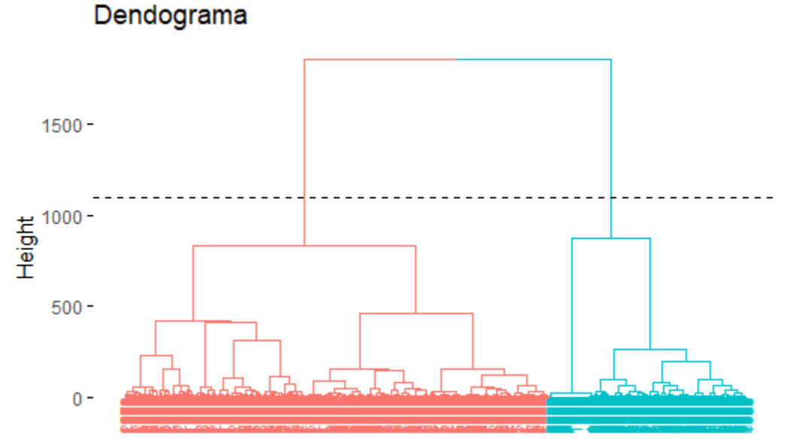
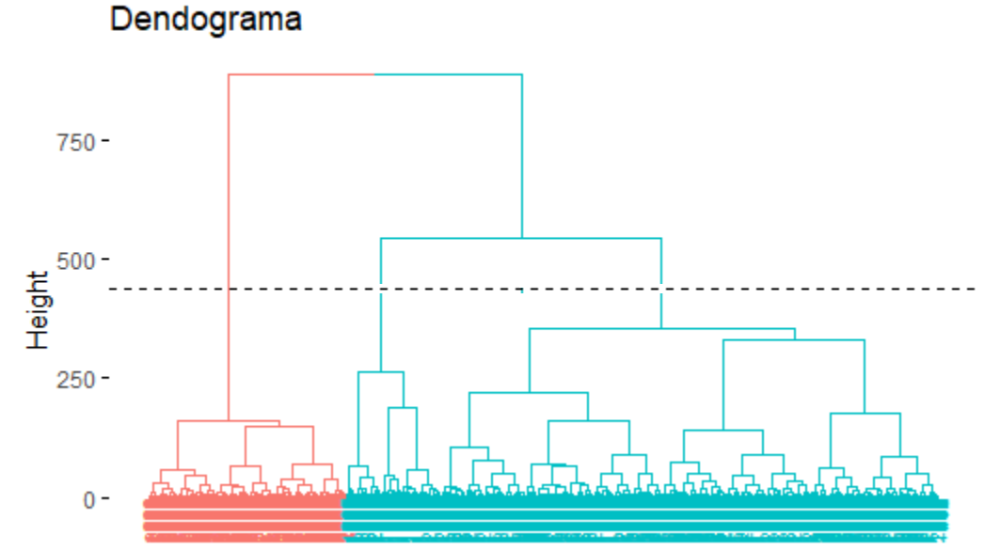

```{r setup, include=FALSE}
knitr::opts_chunk$set(echo = TRUE, warning = FALSE, message = FALSE)
```


# Introducción

En la actualidad se observa una tendencia en las empresas de adoptar un enfoque orientado hacia sus clientes, los comportamientos y necesidades de estos. Esto implica que la organización y todas las personas pertenecientes a ella deben responder a las necesidades de los diferentes clientes, logrando que la empresa responda en tiempo y en forma oportuna las exigencias del medio.

Aquellas empresas con un enfoque orientado hacia los clientes son más rentables, puesto que al conocer y satisfacer mejor las necesidades de los mismos desarrollan relaciones de largo plazo generando mayor lealtad y la posibilidad de futuras negociaciones.

Por ello, surge la necesidad de realizar un proceso de segmentación de clientes que permita a las empresas dividir a sus consumidores en categorías específicas, basadas en características que se extraen de su comportamiento como clientes y la información que pueden obtener de sus interacciones con la empresa; en este estudio en particular se está trabajando con  información de clientes corporativos, es decir, una empresa cuyos clientes también son empresas.

El objetivo es crear grupos de empresas(clientes) para ayudar a la empresa principal, cuyo sector de desarrollo será la banca, con el fin de mejorar el trato a sus clientes además de los servicios y beneficios que les ofrece según sus condiciones, es decir, ayudar a la toma de decisiones para que todo el entorno corporativo funcione de una manera efectiva. Por otro lado, se considera de suma importancia efectuar una segmentación de clientes buscando detectar aquel segmento que genera mayor rentabilidad para el Banco. De este modo, se desarrolla una herramienta que colabore con la nueva percepción de la entidad y que permita migrar con mayor facilidad a un enfoque de gestión orientado hacia los clientes.

### Objetivo

El objetivo es crear grupos  que tengan sentido es decir interpretables para ser clasificados y caracterizados mediante la identificación de patrones de uso de productos y canales y su relación con los estados financieros y que permitan a la empresa tomar acción sobre esos grupos, como el ofrecimiento de sus servicios y entender más a fondo cómo se comportan en el entorno.

### Resumen

El presente trabajo se concentra en una segmentación de clientes, en este caso empresas, de las cuales se tiene información como el uso de canales de entrada y salida que posee el banco y sus características o estados financieros que permiten entender su estructura, es decir si de servicios, de productos, si es grande, pequeña, si se mueve a nivel nacional y/o internacional, como es el comportamiento de sus inventarios, de sus cuentas por cobrar y  pagar y de los diferentes ciclos de negocios y financieros, etc. Esto permite no solo entender como se caracteriza el cliente sino además sus necesidades logrando así ofrecerle servicios que sean beneficiosos, tanto para él como para el banco.


Durante el desarrollo de este trabajo se buscaron diferentes caminos para realizar la segmentación de los clientes. En este documento se presentan las que generaron mejores resultados e hicieron que los grupos tuvieran mayor sentido, además de ello se verificó que todos los procesos fueran estadísticamente válidos.


### Retos

* Entender el entorno donde se desarrolla el trabajo, cual es su objetivo y saber que debido a que es un problema de aprendizaje no supervisado se debe intentar llegar a los resultados que intuitivamente sean más adecuados y coherentes.

* Contextualizar la base de datos para lograr una interpretación correcta de cada variable, sus unidades y rangos.

* Presentar las variables mediante tablas y gráficas permitiendo entender su comportamiento y estructura

* Realizar un correcto análisis descriptivo buscando tener las condiciones óptimas como la aplicación de transformaciones y escalamiento de variables para ser utilizadas de manera correcta en los distintos métodos para el proceso de segmentación.

* Idear diferentes caminos a seguir para realizar los agrupamientos mediante k-means.

* De los caminos seguidos en el punto anterior, escoger el mejor con el fin de realizar comparaciones que sean de provecho.

* Caracterizar los diferentes grupos.

* Plantear posibles estrategias o dar recomendaciones al banco buscando mejorar el trabajo que desarrollan con sus diferentes grupos de clientes.

* Dar conclusiones sobre el estudio.


### Contextualización

El estudio se quiere contextualizar en un entorno o sector bancario, este tiene como clientes a empresas que utilizan sus diferentes servicios por medio de canales de entrada y de salida que tienen fines específicos para cada cliente, es decir, cada cliente puede utilizar diversos canales, con montos y número de transacciones diferente.

Por lo tanto, el objetivo de la entidad bancaria es comprender cómo pueden agruparse sus diferentes clientes según sus características financieras y según el uso que hacen de los canales con el fin de ofrecerles condiciones que se adapten más a sus hábitos. Además, se busca incentivar su participación, permitiendo beneficios por medio de los canales que son de su interés.

Es por esto que la entidad bancaria busca obtener un proceso de segmentación muy bien elaborado, que le permita tomar decisiones frente a sus clientes y contribuya al crecimiento de la organización. Así mismo, es importante entender a los clientes actuales, buscando entender a los nuevos clientes que puedan llegar ya que se les ofrecería los servicios que mejor se adapten a sus características.

<br>

**Contextualización de variables**


_Variables de canales (¿Cómo te usa el cliente?)_

**en_vm_canalX:** valor del ticket promedio de entrada por el canal X

**sal_vm_canalX:** valor del ticket promedio de salida por el canal X

**en_tx_canalX:** cantidad de transacciones de entrada mensuales en promedio por el canal X

**sal_tx_canalX:** cantidad de transacciones de salida mensuales en promedio por el canal X


<br>
 
_Variables financieras (¿Qué necesita el cliente?)_

**impo_cv:** Variable categorizada que hace referencia al porcentaje de insumos que cada empresa obtiene  mediante importación. 

**expo_vt:** Variable categorizada que hace referencia al porcentaje de producción que cada empresa tiene destinado para exportación. 

**cxp:** Número de cuentas por pagar que tiene cada cliente (Deudas). Está categorizada en 6 niveles. 

**cxc:** Número de cuentas por cobrar que tiene cada cliente (Adquisiciones). También puede hacer referencia a lo que el cliente ha vendido y todavía no ha sido pagado.

**totalinventory:** Valor de los inventarios de la empresa al 31 de Diciembre. Está categorizada en 6 niveles, si presta servicios son casi 0. También hace referencia a lo que está para la venta pero no se ha vendido. 

**pagos_pj:** Porcentaje de los pagos que van hacia empresas. Se obtiene de dividir los pagos hechos a personas jurídicas sobre los pagos totales

**pagos_pn:** Porcentaje de los pagos que van hacia personas. Se obtiene de dividir los pagos hechos a personas naturales sobre los pagos totales 

**tiene_ventas_fisicas:** la empresa tiene puntos de venta físicos (1:Si, 0:No)

**tiene_ventas_electronicas:** la empresa tiene ventas electrónicas (1:Si, 0:No)

**recaudos_pj:**  Porcentaje de los recaudos que provienen de empresas. Se obtiene al dividir recaudos provenientes de personas jurídicas sobre los recaudos totales.

**recaudos_pn:** Porcentaje de los recaudos que provienen de personas. Se obtiene al dividir recaudos provenientes de personas naturales sobre los recaudos totales.

**recaudo:** todos los ingresos registrados en un tiempo estimado.

**rotacion_inventarios:** Índice del número de veces que se han renovado las existencias en días, es decir, a cantidad de días que le toma a la empresa realizar rotación de inventarios. Está categorizada con seis niveles, donde entre menor sea el nivel de esta variable, más rápido se venden el producto o servicio que la empresa ofrece. 

**rotacion_cxp:** Hace referencia a la rotación de cuentas por pagar medida en días, esta es un índice que refleja la velocidad con que la empresa ha pagado las deudas contraídas con proveedores ,es decir, capacidad de saldar sus deudas. Está categorizada con 4 niveles.

**rotacion_cxc:** Hace referencia a la rotación de cuentas por cobrar medida en días, esta es un índice de la velocidad con la que una empresa cobra sus cuentas, es decir, capacidad de transformarlas en dinero efectivo. Está categorizada con 4 niveles.

**ciclo_negocio:** Es el ciclo de negocio medido en días, es decir, el índice del número de días que le toma a una empresa llevar a cabo todas sus operaciones de negocio. Está categorizada con 6 niveles.

**ciclo_financiero:** Es el ciclo financiero medido en días, es decir, el índice del número de días que le toma a una empresa llevar a cabo todas sus operaciones financieras. Entre más pequeño, más rápido recupera la empresa su inversión. Está categorizada con 6 niveles.


# Análisis Descriptivo 

* Lectura de la base de datos

```{r}
df <- read.csv("base_trabajo_segmentacion.csv", sep = ";", dec = '.', header = T)
```

```{r, echo = FALSE}
df <- df[, -1]
```

<br>

* Base de datos original

```{r, echo = FALSE}
require(kableExtra)
kable(head(df), align = 'c') %>%
  kable_paper('striped', full_width = F) %>%
  scroll_box(width = "100%", height = "250px")
```

```{r, echo=FALSE}
kable(t(dim(df)), align = 'c', col.names = c('Filas', 'Columnas')) %>%
  kable_paper('striped', full_width = F) %>%
  row_spec(0, background = '#0E9CA6', color='white')
```

* El conjunto de datos cuenta con 2233 registros, es decir, 2233 empresas que son clientes de la compañía en la que se va a realizar el estudio.

* Hay 46 variables de las cuales, la primeras 30 reflejan el uso que cada uno de los clientes le da a los canales ofrecidos por la organización, estos se dividen en canales de entrada y de salida donde algunos miden montos de dinero y otros el número de transacciones realizadas en cada canal. Las 16 variables restantes tienen que ver con características financieras que permiten conocer algunas peculiaridades del perfil o estructura de la empresa(cliente).

<br>

<div id="porque-logaritmo"></div>
### ¿Por qué realizar la transformación de logaritmo natural?

Para las variables asociadas a los canales se realiza la transformación logaritmo natural para trabajar con escalas que permitan una mejor visualización y comprensión del comportamiento de estas, esta transformación es de mucha utilidad cuando se cuenta con valores extremos, que en este caso particular se presentan y han hecho menos viable la compresión de las diferentes variables, además de que esta transformación solo cambia la escala y permite que muchas interpretaciones se puedan seguir realizando como cuáles canales son los que manejan mayores o menores montos de dinero o mayor o menor número de transacciones, por lo tanto esta transformación da habilidad para acotar el rango de la variable en una cantidad más pequeña que la original. Este efecto reduce la sensibilidad de las estimaciones a las observaciones extremas, lo cual en este estudio ha sido de mucha utilidad y ha permitido realizar unas mejores agrupaciones.

<div id="porque-escalar"></div>
### ¿Por qué escalar las variables para realizar las agrupaciones?

Dado que se está trabajando con el algoritmo k-means el cual está basado en distancias, la escala de las diferencias variables influyen mucho en los resultados que se obtienen, lo que lleva a dar más peso a variables cuyos rangos son más grandes, por lo tanto se acudió a un procedimiento que se llama escalamiento o estandarización de variables, el cual permite trabajar sobre un mismo rango de valores en las diferentes variables ya que permite quitar las unidades de medidas de cada uno de las variables, permitiendo que estas se puedan comparar entre sí sin problema.


### Separación de las variables financieras y canales (no escaladas)

```{r}
finan_no_scaled <- df[, 31:46]
Canal_no_scaled <- df[ , 1:30]
```

### Separando en conjunto de datos en variables de canales y variables financieras donde ya están escaladas:

```{r}
# Escalamiento de los datos completos
df_scaled <- scale(df, center = T, scale = T)

Canal_scaled <- df_scaled[,1:30]
finan_scaled <- df_scaled[,31:46]
```


### Variables de los canales en logaritmo sin escalar y escalados

```{r}
Canal_log <- log(Canal_no_scaled + 1) 

Canal_log_scaled <- scale(log(Canal_no_scaled + 1), center = T, scale = T)
```


<br>

### Análisis descriptivo de las variables de canales de entrada y salida que reflejan los montos de dinero en millones de pesos:

```{r, echo=FALSE}
require(kableExtra)
kable(summary(Canal_no_scaled[c(1:11, 23:26)]/1000000), align = 'c') %>%
  kable_paper('striped', full_width = F) %>%
  scroll_box(width = "100%", height = "330px")
```


<br>

### Análisis descriptivo de las variables de canales de entrada y salida que muestran el número de transacciones:

```{r, echo=FALSE}
require(kableExtra)
kable(summary(Canal_no_scaled[c(12:22, 27:30)]), align = 'c') %>%
  kable_paper('striped', full_width = F) %>%
  scroll_box(width = "100%", height = "330px")
```


<br>

- Dado que se cuenta con unas cifras numéricas muy grandes, se decide realizar el análisis gráfico de estas variables mediante el logaritmo, ya que este permite una mejor visualización y comprensión de cuales canales tienen mayor uso, cuales manejan mayor dinero y cuales realizan mayor número de transacciones haciendo posible una mejor comprensión del funcionamiento de los distintos canales.

<br>

**Gráfico de la media en logaritmo natural de cada variable asociadas a los canales**

```{r, echo=FALSE, eval=FALSE}
fila_porcentaje <- function(fila){
  
  fila_suma <- sum(fila)
  
  if(fila_suma != 0){
    
    return(fila/fila_suma)
  }else{
   
    return(fila)
  }
}


Canal_porcentaje <- Canal_no_scaled


Canal_porcentaje[, 1:11] <- t(apply(Canal_no_scaled[, 1:11], 1, fila_porcentaje))

Canal_porcentaje[, 12:22] <- t(apply(Canal_no_scaled[, 12:22], 1, fila_porcentaje))

Canal_porcentaje[, 23:26] <- t(apply(Canal_no_scaled[, 23:26], 1, fila_porcentaje))

Canal_porcentaje[, 27:30] <- t(apply(Canal_no_scaled[, 27:30], 1, fila_porcentaje))

```

<center>

```{r, fig.align="center"}

plot(1:30, colMeans(Canal_log), type = 'b', xaxt = "n", xlab = '', 
     lwd = 2, ylab = 'Media', col="cyan4", main="Gráfico de la medias de los canales en logaritmo natural", pch=19)
axis(1, 1:30, names(df)[1:30], las = 2, cex.axis = 0.7)
grid()
```

</center>


<h4> <center>Boxplots del logaritmo natural de las variables de los canales</center> </h4>


<center>

```{r, echo = FALSE, fig.align="center"}
par(mfrow=c(1,2),pty="s")
boxplot(log(df[,1:11]+1), las=2, col="cyan4", main = "montos de entrada anual", cex.main=0.8, cex.names = 0.7)
grid()
boxplot(log(df[,12:22]+1), las=2, col="cyan4", main = "transacciones de entrada mensual", cex.main=0.8, cex.names=0.7)
grid()
```

</center>

<center>

```{r, echo = FALSE, fig.align="center"}
par(mfrow=c(1,2),pty="s")
boxplot(log(df[,23:26]+1), las=2, col="cyan4", main="montos de salida anual", cex.main=0.8)
grid()
boxplot(log(df[,27:30]+1), las=2, col="cyan4", main = "transacciones de salida mensual", cex.main=0.8)
grid()
```

</center>

### Mediante los gráficos se puede analizar que:

_Análisis de los canales de entrada:_

* Los canales de entrada que manejan un monto promedio más alto de dinero son: canal1, canal2, canal6, canal8 y canal9.

* Los canales de entrada que manejan un monto promedio más bajo de dinero son: canal4, canal7, canal10 y canalOtros.

* Los canales de entrada que manejan en promedio un mayor número de transacciones son: canal1 y canal2

* Los canales de entrada que manejan en promedio un número intermedio de transacciones son: canal3, canal4, canal5, canal6, canal8 y canal9.

* Los canales de entrada que manejan en promedio un menor número de transacciones son: canal7, canal10 y CanalOtros.

En general, en los canales de entrada, el canal1 y el canal2 son los que manejan un mayor monto promedio de dinero y un mayor número de transacciones; por otro lado, el canal7 y el canal10 son los que manejan menor monto promedio de dinero y un menor número de transacciones. También se puede visualizar particularmente que a pesar de que el canal5 maneja un mayor monto promedio de dinero que el canal4, en el canal5 se presenta un menor número de transacciones que en el canal4.

_Análisis de los canales de salida:_

* El canal de salida que maneja un monto promedio mayor de dinero es el canal2.

* El canal de salida que maneja un monto promedio intermedio de dinero es el canal5.

* Los canales de salida que manejan un monto promedio menor de dinero son el canal8 y canalOtros.

* El canal de salida que maneja en promedio un mayor número de transacciones es el canal2.

* Los canales de salida que manejan en promedio un menor número de transacciones son el canal5, canal8 y CanalOtros, aunque entre estos el canal5 es el que realiza un mayor número de transacciones.

En general en los canales de salida, el canal2 es el que maneja un mayor monto promedio de dinero, además un mayor número de transacciones; por otro lado el canal8 y canalOtros son los que manejan los menores montos promedio de dinero y menor números de transacciones.

<center> <h2>  Matriz de correlación asociada a las variables de los canales: </center> </h2>

```{r, message=FALSE, warning=FALSE, fig.align="center", eval = FALSE}
library(corrplot)
corrplot(cor(Canal_no_scaled), 
         method="color",  
         type="upper", order='original', 
         addCoef.col = "black", # Add coefficient of correlation
         tl.col="black", tl.srt=45, #Text label color and rotation
         sig.level = 0.01, insig = "blank", 
         number.cex = 0.5,
         # hide correlation coefficient on the principal diagonal
         diag=FALSE
         )
```


<center>


</center>

* El canal de entrada 3 parece estar positivamente correlacionado con el canal de entrada 9 y con el número de transacciones por el canal 3 y 9.

* El canal de entrada 4 parece estar positivamente correlacionado con los canales de entrada 5 y 7, con el número de transacciones por el canal 4 y con el canal de salida 5.

* Existe una fuerte correlación lineal positiva entre el canal de entrada 5 y el número de transacciones en el canal 4 y el canal 2 de salida. Además de una correlación de 1 con el canal 5 de salida.

* Parece que el canal de entrada 6 no se encuentra linealmente correlacionado con los demás canales.

* Existe una fuerte correlación lineal positiva entre el número de transacciones del canal 4 y el canal 2 de salida.

* El canal de entrada 8 parece estar positivamente correlacionado con el canal 8 de salida.

* El canal de entrada otros parece estar positivamente correlacionado con el número de transacciones del canal 1.

* Existe una fuerte correlación lineal positiva entre el número de transacciones del canal 5 y el número de transacciones por el canal 2 de salida.

* El canal 2 de salida parece estar positivamente correlacionado con el canal 2 de salida.

<hr>

**Análisis descriptivo de las variables financieras:**

<h4> <center> Gráficos descriptivos de cada una de las variables financieras </center> </h4> 

* Gráficos de frecuencias relativas para las variables categoricas

* Gráficos de histograma para las variables continuas

<center>

```{r, message=FALSE, warning=FALSE, , fig.align="center", echo=FALSE}
library(ggplot2)
for(i in 1:dim(finan_no_scaled)[2]){
  
  if(class(finan_no_scaled[, i])=="integer"){
    p <- ggplot(finan_no_scaled, aes(x = finan_no_scaled[, i], y = ..prop..))+ geom_bar(fill = "#0c4c8a")
  }else{
    p <- ggplot(finan_no_scaled, aes(x=finan_no_scaled[, i])) +  geom_histogram(bins = 10, fill = "#0c4c8a")
  }
  
  p_final <- p +
    labs(x = colnames(finan_no_scaled)[i]) +
    theme_gray() 
    
  
  print(p_final)
}
```

</center>

- **impo_cv: ** Más del 60% de los clientes tiene un nivel de importación entre 1 y 2.

- **expo_vt: ** Más del 50% de los clientes tiene un nivel del exportación de 2.

- **cxp: ** Más del 50% de los clientes tiene un número bajo de cuentas por pagar (1 y 2). También destaca que más del 15% de los clientes están en el nivel más alto de cuentas por pagar (6).

- **cxc: ** Más del 25% de los clientes se encuentran en el nivel más alto del número de cuentas por cobrar (6), sin embargo más del 55% de los clientes se encuentra en el nivel 1, 2 y 3 de cuentas por cobrar.
 
- **totalinventory: ** Casi un 25% de los clientes está en el nivel más alto del valor de inventario al 31 de diciembre, el grueso de los clientes se encuentra en el nivel 1, 2 y 3.

- **pagos_pj: ** 

  * El 75% de los clientes tiene un porcentaje de pago a personas jurídicas que ronda entre el 31.6 y el 77.4 porciento. 
  
  * También se puede observar que en promedio el porcentaje de pago a personas jurídicas está en el 53.9%.
  
  * Aproximadamente un 25% de los clientes de la empresa, tiene un porcentaje de pago a personas jurídicas que ronda entre el 78 y el 100 porciento.
  
- **pagos_pn: **

  * El 75% de los clientes tiene un porcentaje de pago a personas naturales que ronda entre el 20 y el 66.5 porciento. 
  
  * También se puede observar que en promedio el porcentaje de pago a personas naturales está en el 44%.
  
  * Aproximadamente un 25% de los clientes de la empresa, tiene un porcentaje de pago a personas naturales que ronda entre el 0 y el 19 porciento.

- **tiene_ventas_fisicas: ** El 52.4% de los clientes no tiene ventas físicas, mientras que el 47.5% sí.

- **tiene_ventas_electronicas: ** Aproximadamente el 95% de los clientes no tiene ventas electrónicas.

- **recaudos_pj: ** El 93.2% de los clientes de la empresa no tienen ingresos provenientes de personas jurídicas. Aproximadamente el 0.8% de los clientes tienen todos sus ingresos de personas jurídicas.

- **recaudos_pn: ** El 92.1% de los clientes de la empresa no tiene ingresos provenientes de personas naturales. Aproximadamente el 2% de los clientes tienen todos sus ingresos de personas naturales.

- **rotacion_inventarios: ** Un poco más del 20% de los clientes se encuentra en el nivel de rotación más lento de inventario en días (nivel 6). Aproximadamente el 48% de los clientes se encuentra en el nivel de rotación más rápido (nivel 1 y 2).

- **rotacion_cxc: ** Aproximadamente el 55% de los clientes tiene una velocidad alta (nivel 1 y 2) para cobrar sus cuentas.

- **rotacion_cxp: ** Aproximadamente el 65% de los clientes tiene una velocidad alta (nivel 1 y 2) para pagar sus cuentas.

- **cliclo_negocio: ** El 45% de los clientes tiene un ciclo de negocio lento, es decir en los niveles más altos (5 y 6). Aproximadamente el 23% de los clientes tiene un ciclo de negocio nivel 4, es decir medio-lento.

- **cliclo_financiero: ** El 45% de los clientes tiene un ciclo de financiero lento, es decir en los niveles más altos (5 y 6).


### A continuación se pueden observar las características financieras de un cliente promedio.

<center>

```{r, fig.align="center", echo=FALSE}
plot(1:16, colMeans(finan_no_scaled), type = 'b', col = 'cyan4', 
     xaxt = "n", xlab = '', lwd = 2, ylab = 'Media', ylim = c(0, 4.3),main= "Gráfico de las medias de las variables financieras", pch=19)
axis(1, 1:16, names(df)[31:46], las = 2)
text(apply(finan_no_scaled, 2, mean)+0.2, labels = round(apply(finan_no_scaled, 2, mean), 1))
grid()
```

</center>


<h4> <center> Matriz de correlaciones entre las variables financieras </center> </h4>

<center>

```{r, message=FALSE, warning=FALSE, fig.align="center", echo=FALSE}
library(corrplot)
corrplot(cor(finan_no_scaled), 
         method="color",  
         type="upper", order="hclust", 
         addCoef.col = "black", # Add coefficient of correlation
         tl.col="black", tl.srt=45, #Text label color and rotation
         sig.level = 0.01, insig = "blank", 
         number.cex = 0.6,
         # hide correlation coefficient on the principal diagonal
         diag=FALSE 
         )

```

</center>

- Se observa una relación inversamente proporcional entre las variables pagos_pj y pagos_pn, con una correlación de 0.88.

- Se observa una buena relación lineal entre las variables rotacion_inventarios y ciclo_negocio, con un coeficiente de correlación de 0.77.

- Se observa una relación positiva buena entre ciclo_negocio y ciclo_financiero, con un coeficiente de correlación del 0.77.

- Se observa una relación moderada entre rotacion_inventarios y ciclo_financiero, con una correlación de 0.65.

- Se observa una relación moderada entre ciclo_negocio y rotacion_cxc, con una correlación de 0.59.

- Se observa una relación positiva grande entre impo_cv y expo_vt, con una correlación de 0.87.

- Se observa una relación positiva moderada entre totalinventory y cxp, con una correlación de 0.58.

- Se observa una relación positiva moderada entre totalinventory y cxc, con una correlación de 0.52.

- Se observa una relación positiva moderada entre cxp y cxc, con una correlación de 0.68.


# Segmentación

## Procedimientos para llegar a la segmentación 

Ya que se tuvo una exploración de las diferentes variables de canales y financieras, se pudo comprender que el comportamiento de los clientes en este tipo de variables es muy particular, ya que las variables asociadas a los canales ayudan a entender mejor como usa el cliente la compañía y las variables financieras muestran que necesita el cliente de la compañía a partir de sus características. Por este motivo se considera que los procedimientos de segmentación de clientes se deben hacer de manera independiente entre las variables de los canales y las variables financieras, dado que se espera que salgan grupos muy diferentes realizando la segmentación mediante estos dos tipos de variables debido a que cada una estudia perspectivas muy diferentes del cliente. Se concilió entonces, realizar el proceso de segmentación por un tipo de variable y luego realizar subgrupos por el otro tipo de variable a partir de los grupos creados inicialmente.


Las variables de los canales son variables cuantitativas que en general tienen valores extremos, al ser utilizados en la segmentación pueden crear un gran impacto en los grupos resultantes, dado que el algoritmo que se usa "K-means" es muy sensible a observaciones extremas, por lo tanto para solucionar este problema se decide realizar una transformación logaritmo natural sobre las variables asociadas a los canales.


<a href="#porque-logaritmo">**(¿Por qué realizar la transformación de logaritmo natural?)**</a>

Además de ello el algoritmo de segmentación K-means es muy sensible a las unidades de las diferentes variables dado que está basado en distancias, por lo tanto, así se aplique una transformación logaritmo natural, se deben escalar las variables para que todas puedan ser comparadas entre sí y los resultados sean estadísticamente válidos.

<li class="withripple" data-target="#porque-escalar"><a href="#porque-escalar">**¿Por qué escalar las variables para realizar las agrupaciones?**</a><div class="ripple-container"></div></li>


## Introducción Kmeans

Dado que en nuestra base de datos no existe una variable respuesta específica que se desee predecir, una forma relativamente rápida de detectar patrones y determinar características similares entre los clientes es la clasificación no supervisada o análisis de agrupamiento (clustering).

En este caso se utiliza el algoritmo  de agrupación K-means, el cual consiste en que para un conjunto de datos de variables numéricas se repiten una serie de pasos hasta asignar cada observación a uno de k grupos donde la distancia a la media del grupo sea la más corta.


```{r, echo =FALSE}
# Lectura de la base de datos original
df <- read.csv("base_trabajo_segmentacion.csv", sep = ";", dec = '.', header = T)
df <- df[, -1]

# Separación de las variables financieras y canales

# Se crea un conjunto con las variables sin escalar
finan_no_scaled <- df[, 31:46]
Canal_no_scaled <- df[ , 1:30]

# Se crea un conjunto con las variables escaladas
df_scaled <- scale(df, center = T, scale = T)
Canal_scaled <- df_scaled[,1:30]
finan_scaled <- df_scaled[,31:46]

# Se aplica transformación logaritmo natural a los canales y se escala
Canal_log <- log(Canal_no_scaled + 1) 
Canal_log_scaled <- scale(log(Canal_no_scaled + 1), center = T, scale = T)
```


# Procedimiento de segmentación 1

En este caso, se decide realizar una segmentación mediante las variables asociadas a los canales y en cada uno de los grupos que se obtengan a partir de esta se va a realizar una segmentación adicional (subgrupos) teniendo en cuenta las variables financieras, de tal manera que cada grupo final se caracterice por tener un comportamiento particular tanto en las variables de los canales como en las variables financieras.

A continuación se presenta el procedimiento desarrollado realizando una segmentación con todas las variables asociadas a los canales, primero se les aplica logaritmo natural y luego se escalan, posteriormente en cada uno de los grupos resultantes se realiza una subagrupación solo teniendo en cuenta las variables financieras:

* Se utiliza agrupamiento jerárquico con la idea de conocer la cantidad de grupos que se deben considerar 

```{r, message=FALSE, warning=FALSE, eval = FALSE}
library(ggdendro)
library(ggplot2)
require(factoextra)

dendrogram <- hclust(dist(Canal_log_scaled, method = 'euclidean'), method = 'ward.D')


plot(dendrogram, xlab="", sub="", cex=0.9)
rect.hclust(dendrogram, k=2, border="cyan4")
```

<center>


</center>

* Del gráfico se concluye adecuado considerar dos grupos.


<h2> <center> Agrupamiento k means con las variables de los canales (usando transformación logaritmo natural): </center> </h2>

<center>

```{r, fig.align="center"}
require(cluster)

set.seed(93285)
Agru_canal<- kmeans(Canal_log_scaled, 2 , nstart = 5, iter.max = 100)

clusplot(Canal_log_scaled, Agru_canal$cluster, color = TRUE, 
          shade = FALSE, labels = 4, lines = 1, 
          col.clus = c("darkgreen", "darkblue"),
          col.p = ifelse(Agru_canal$cluster == 2, "darkblue","darkgreen"), 
          main = "Grupos seleccionados de canales mediante K-means", 
          xlab = "Componente principal 1 canales",
          ylab = "Componente principal 2 canales",
          sub = "")
grid()
```

</center>

En el gráfico anterior se puede observar una representación en dos dimensiones de los grupos encontrados por K-means. 


- Se agrega la variable que indica el grupo al conjunto de datos

```{r}
grupos <- as.factor(Agru_canal$cluster) # Se extraen los grupos

# Se agrega a los canales la variable grupo
canal_group <- data.frame(grupos, Canal_no_scaled)
```


```{r, echo=F}
require(kableExtra)
kable(head(canal_group), align = 'c') %>%
  kable_paper('striped', full_width = F) %>%
  scroll_box(width = "100%", height = "250px")
```


<br>

- Valor medio de cada variable en canal discriminada por grupo

```{r, echo=FALSE}
require(kableExtra)
kable(aggregate(.~grupos, data=canal_group, FUN = mean), align = 'c') %>%
  kable_paper('striped', full_width = F) %>%
  scroll_box(width = "100%", height = "125px")
```

<br>

- Número de clientes en cada uno de los grupos

```{r, echo=F}
require(kableExtra)
kable(table(Agru_canal$cluster), align = 'c', col.names = c('Grupo', 'Número de clientes')) %>%
  kable_paper('striped', full_width = F) %>%
  row_spec(0, background = '#0E9CA6', color='white')
```

<br>

El grupo 1 cuenta con 1281 clientes y el grupo 2 con 952 clientes, en general el grupo 1 tiene a los clientes que tienden a manejar montos más altos de dinero y mayor número de transacciones por todos los canales en comparación con los del grupo 2.


<h2> <center> Gráficos de boxplot que permitirán sacar caraterísticas de cada uno de los grupos </center> </h2>

* Los gráficos son de las variables de los canales en escala logaritmo natural

<center>

```{r, fig.align="center", echo=FALSE}
library(ggplot2)
for(i in 2:dim(canal_group)[2]){
 
 p <-  ggplot(canal_group, aes(x = factor(grupos), y=log(canal_group[, i]+1))) +  
   geom_boxplot() +
   geom_jitter(color="darkblue", size=0.4, alpha=0.9) +
    labs(x = colnames(canal_group)[i], y = "Escala log natural") +
    theme_gray() 
    
  
  print(p)
}

```

</center>

- En términos generales, se puede observar que el grupo 1 presenta en promedio un monto y un número mayor de transacciones.

- Se puede notar una mayor dispersión del grupo 2 en los canales de entrada 3, 6, 8, y 9 y en el grupo1 en el canal otros.

- En general en los canales de entrada asociados al número de transacciones el grupo 1 presenta una mayor dispersión, en parte debido a una mayor cantidad de valores extremos.

- En los canales de salida, tanto para montos como para transacciones, el grupo 1 parece estar más disperso en el canal 5, mientras que el grupo 2 lo está en el canal 2, en el resto de canales el comportamiento es similar aunque el grupo 1 presenta más valores extremos. 

<br>

### Se ingresa la variable que indica los grupos a los conjuntos de datos escalados y sin escalar, adicional a eso se crear sub bases de datos para cada uno de los grupos para ser utilizados en los siguientes pasos de segmentación


```{r}
df_scaled_group <- data.frame(grupos, Canal_log_scaled, finan_scaled) #conjunto de datos escalados

#Separacion de los grupos formados, variables escaladas
grupo1_scaled <- df_scaled_group[df_scaled_group$grupos==1,]
grupo2_scaled <- df_scaled_group[df_scaled_group$grupos==2,]

#conjunto de datos original mas la variable grupos
df_group <- data.frame(grupos,df)

#Separacion de los grupos formados, variables sin escalar
grupo1_no_scaled <- df_group[df_group$grupos==1,]
grupo2_no_scaled <- df_group[df_group$grupos==2,]

#Logaritmo natural en las variables de los canales
df_group_log <- df_group
df_group_log[, 2:31] <- log(df_group[, 2:31] + 1)

#Media de los grupos, canales escala-log natural
media_df_grupcanal <-  aggregate(.~grupos,data=df_group_log, FUN=mean)

```

<br>

<h4> <center>  Análisis del valor medio de los grupos en cada variable </center> </h4>

<br>

**Gráfico de los grupos en las variables de los canales**

<center>

```{r, fig.align="center", echo=FALSE}
plot(1:30, media_df_grupcanal[1, 2:31], type = 'b', col = 'darkgreen', 
     xaxt = "n", xlab = '', lwd = 2, ylab = 'media escala log natural', ylim  = c(0, 22), main= "Media de los grupos mediante las variables de canales")
axis(1, 1:30, names(media_df_grupcanal)[2:31], las = 2, cex.axis = 0.7)
lines(1:30, media_df_grupcanal[2, 2:31], col = 'darkblue', type = "b", lwd = 2)


legend(25, 23, legend=c("Grupo1","Grupo2"),
       col=c("darkgreen", "darkblue"), lty=c(1, 1, 1, 3), lwd = 2, cex = 0.8, bty = 'n')
grid()
```

</center>

De la gráfica anterior, se puede ver que en general hay un comportamiento similar entre ambos grupos, sin embargo, el grupo 1 presenta un monto y un número mayor de transacciones promedio. Siendo la diferencia más amplia en los canales de entrada 3, 5, 6, 8, 9 y en los canales de salida 5 y 2.

<br>

<h4> <center> media de los grupos mediante las variables financieras </h4> </center>

<br>

<center>

```{r, fig.align="center", echo=FALSE}
par(mfrow=c(1,3))
plot(1:5, media_df_grupcanal[1, 32:36], type = 'b', col = 'darkgreen', 
     xaxt = "n", xlab = '', lwd = 2, ylab = 'centroide', ylim=c(0, 5.5))
axis(1, 1:5, names(media_df_grupcanal)[32:36], las = 2)
lines(1:5, media_df_grupcanal[2, 32:36], col = 'darkblue', type = "b", lwd = 2)

legend("bottomright", legend=c("Grupo1","Grupo2"),
       col=c("darkgreen", "darkblue"), lty=1, bty = 'n')
grid()


plot(1:6, media_df_grupcanal[1, 37:42], type = 'b', col = 'darkgreen', 
     xaxt = "n", xlab = '', lwd = 2, ylab = 'centroide', ylim = c(0, 1))
axis(1, 1:6, names(media_df_grupcanal)[37:42], las = 2)
lines(1:6, media_df_grupcanal[2, 37:42], col = 'darkblue', type = "b", lwd = 2)

legend("topright", legend=c("Grupo1","Grupo2"),
       col=c("darkgreen", "darkblue"), lty=1, bty = 'n')
grid()

plot(1:5, media_df_grupcanal[1, 43:47], type = 'b', col = 'darkgreen', 
     xaxt = "n", xlab = '', lwd = 2, ylab = 'centroide', ylim = c(0, 5.5))
axis(1, 1:5, names(media_df_grupcanal)[43:47], las = 2)
lines(1:5, media_df_grupcanal[2, 43:47], col = 'darkblue', type = "b", lwd = 2)

legend("bottomright", legend=c("Grupo1","Grupo2"),
       col=c("darkgreen", "darkblue"), lty=1, bty = 'n')
grid()
```

</center>


El grupo 1 maneja montos de dinero y número de transacciones promedio más grandes en los canales, a su vez, se pueden observar valores promedios más grandes en las cuentas por pagar, cuentas por cobrar y en el total de inventario y aunque el número de importaciones y exportaciones promedio es mayor que la del grupo 2, la diferencia es muy pequeña, además el grupo 1 tiende a tener una mayor proporción de tiendas físicas. En las demás variables el comportamiento promedio es bastante similar.


### Se crean subgrupos mediante las variables financieras para cada grupo creado con canales


* Agrupamiento por variables financieras para el grupo 1 de canales:


- Se utiliza agrupamiento jerárquico con la idea de conocer la cantidad de grupos que se deben considerar 

```{r, eval=FALSE}
dendrogram <- hclust(dist(grupo1_scaled[,32:47], method = 'euclidean'), method = 'ward.D')

plot(dendrogram, xlab="", sub="", cex=0.9)
rect.hclust(dendrogram, k=3, border="cyan4")
```

<center>


</center>

Del dendograma anterior se concluye considerar 3 subgrupos.


<h4> <center>Subagrupamientos mediante las variables de estados financieros usando k-means :</center> </h4>


```{r, echo=FALSE}
require(cluster)

get_color_grupo1 <- function(valor){
  
  if(valor == 1){
    return("#B2F768") 
  }
  else if (valor == 2){
    return("#46EB65")
  }
  else{
    return("#206B2E")
  }
  
}
```

<center>

```{r, fig.align="center"}

set.seed(9325)
kc1 <- kmeans(grupo1_scaled[,32:47], 3 , nstart = 5, iter.max = 100)

clusplot(grupo1_scaled[,32:47], kc1$cluster, color = TRUE, 
          shade = FALSE, labels = 4, lines = 1,
          col.clus = c("#46EB65", "#206B2E", "#B2F768"),
          col.p = sapply(kc1$cluster, get_color_grupo1), 
          main = "Subgrupos del grupo 1 de canales mediante K-means", 
          xlab = "Componente principal 1 canales",
          ylab = "Componente principal 2 canales",
          sub = "")
grid()


```

</center>

```{r, echo=F}
require(kableExtra)
kable(table(kc1$cluster), align = 'c', col.names = c('Grupo', 'Número de clientes')) %>%
  kable_paper('striped', full_width = F) %>%
  row_spec(0, background = '#0E9CA6', color='white')
```

Nuevamente se le agrega al conjunto de datos la variable que indica el sub-grupo a partir de la segmentación con K-means en las variables financieras


```{r}
canal1_finan <- data.frame(sub_grupos=kc1$cluster, grupo1_no_scaled)
canal1_finan$sub_grupos <- as.factor(canal1_finan$sub_grupos)
```


```{r, echo=FALSE}
require(kableExtra)
kable(head(canal1_finan), align = 'c') %>%
  kable_paper('striped', full_width = F) %>%
  scroll_box(width = "100%", height = "250px")
```


```{r}

canal1_finan_log <- canal1_finan
canal1_finan_log[, 3:32] <- log(canal1_finan_log[, 3:32] + 1)

media_canal1_finan <-  aggregate(.~sub_grupos,data=canal1_finan_log, FUN=mean)

```

<br>

<h4> <center> Análisis del valor medio de los grupos en cada variable </center> </h4>

<br>

<center>

```{r, fig.align="center", echo=FALSE}
plot(1:30, media_canal1_finan[1, 3:32], type = 'b', col = get_color_grupo1(1), 
     xaxt = "n", xlab = '', lwd = 2, ylab = 'media escala log natural', ylim  = c(0, 22), main="Subgrupos con financieras del grupo 1 de canales")
axis(1, 1:30, names(media_canal1_finan)[3:32], las = 2, cex.axis = 0.7)
lines(1:30, media_canal1_finan[2, 3:32], col = get_color_grupo1(2), type = "b", lwd = 2)
lines(1:30, media_canal1_finan[3, 3:32], col = get_color_grupo1(3), type = "b", lwd = 2)


legend("topright", legend=c("Sub-grupo 1","Sub-grupo 2", "Sub-grupo 3"),
       col=c(get_color_grupo1(1), get_color_grupo1(2), get_color_grupo1(3)), lty=c(1, 1, 1, 3), lwd = 2, cex = 0.8, bty = 'n')
grid()
```

</center>

De la grafica presentada previamente se espera que los tres grupos tengan un comportamiento y valores promedios muy similares, dado que está siendo graficada en las variables asociados a los canales y estos sub grupos fueron hallados a partir del grupo 1 de las variables de los canales, por lo tanto se espera que estos tres grupos tengan sus diferencias en las variables financieras pero sean muy similares en los canales.  

<center>

```{r, fig.align="center", echo=FALSE}
plot(1:16, media_canal1_finan[1, 33:48], type = 'b', col = get_color_grupo1(1), 
     xaxt = "n", xlab = '', lwd = 2, ylab = 'media', main="Subgrupos con financieras del grupo 1 de canales")
axis(1, 1:16, names(media_canal1_finan)[33:48], las = 2, cex.axis = 0.7)
lines(1:16, media_canal1_finan[2, 33:48], col = get_color_grupo1(2), type = "b", lwd = 2)
lines(1:16, media_canal1_finan[3, 33:48], col = get_color_grupo1(3), type = "b", lwd = 2)

legend("bottomright", legend=c("Sub-grupo 1","Sub-grupo 2", "Sub-grupo 3"),
       col=c(get_color_grupo1(1), get_color_grupo1(2), get_color_grupo1(3)), lty=1, bty = 'n')
grid()
```

</center>

* Los tres grupos toman valores promedios diferentes en las distintas variables financieras, lo que indica la diferencia esperada ellas.

* El sub-grupo 1 del grupo 1 tiende a tener el mayor número promedio de importaciones, exportaciones, inventarios y además de ello es al que le toma más tiempo realizar las rotaciones de inventarios, rotaciones de cuenta por cobrar y pagar y realizar los ciclos de negocio y financieros. En los pagos y recaudos a personas jurídicas y naturales tiende a tener porcentajes bajos.

* El sub-grupo 2 del grupo 1 en comparación a los otros grupos, tiende a tener un número promedio o intermedio de importaciones, exportaciones, inventarios, al igual que las rotaciones de inventarios, rotaciones de cuentas por cobrar y pagar y tiempos promedios en la realización de los ciclos de negocio y financiero, pero cabe aclarar que es el que tiene mayor número promedio de cuentas por cobrar y cuentas por pagar, pagos a personas jurídicas y naturales, recaudos a personas jurídicas y naturales, además que es el que cuenta con mayor número de tiendas físicas y electrónicas.

* El sub-grupo 3 del grupo 1 es el que en general tiende a tener menores niveles promedios en todas las variables financieras, es decir es el que realiza menos importaciones, exportaciones, tiene menor número de  cuentas por cobrar y por pagar, menores inventarios, le toma menos tiempo realizar las rotaciones de inventarios, rotaciones de cuenta por cobrar y pagar y realizar los ciclos de negocio y financieros. En los pagos y recaudos a personas jurídicas y naturales tiende a tener porcentajes bajos.

<br>

* Agrupamiento por variables financieras para el grupo 2 de canales:


- Se utiliza agrupamiento jerárquico con la idea de conocer la cantidad de grupos que se deben considerar 


```{r, eval = FALSE}
dendrogram <- hclust(dist(grupo2_scaled[, 32:47], method = 'euclidean'), method = 'ward.D')

plot(dendrogram, xlab="", sub="", cex=0.9)
```


<center>


</center>


Del dendograma anterior se concluye considerar 3 subgrupos.


### Subagrupamientos mediante las variables de estados financieros usando k-means :

```{r, echo=FALSE}
require(cluster)

get_color_grupo2 <- function(valor){
  
  if(valor == 1){
    return("#48D9FB") 
  }
  else if (valor == 2){
    return("#0669AC")
  }
  else{
    return("#000080")
  }
  
}
```

<center>

```{r, fig.align="center"}

set.seed(9326)
kc2 <- kmeans(grupo2_scaled[, 32:47], 3, nstart = 5, iter.max = 100)

clusplot(grupo2_scaled[,32:47], kc2$cluster, color = TRUE, 
          shade = FALSE, labels = 4, lines = 1,
          col.clus = c("#0688AC", "#0669AC", "#000080"),
          col.p = sapply(kc2$cluster, get_color_grupo2), 
          main = "Subgrupos del grupo 2 de canales mediante K-means", 
          xlab = "Componente principal 1 canales",
          ylab = "Componente principal 2 canales",
          sub = "")
grid()


```

</center>

```{r, echo=FALSE}
kable(table(kc2$cluster), align = 'c', col.names = c('Grupo', 'Número de clientes')) %>%
    kable_paper('striped', full_width = F) %>%
  row_spec(0, background = '#0E9CA6', color='white')
```


Nuevamente se le agrega al conjunto de datos la variable que indica el sub-grupo a partir de la segmentación con K-means en las variables financieras


```{r}
canal2_finan <- data.frame(sub_grupos=kc2$cluster, grupo2_no_scaled)
canal2_finan$sub_grupos <- as.factor(canal2_finan$sub_grupos)
```


```{r, echo=F}
kable(head(canal2_finan), align = 'c') %>%
    kable_paper('striped', full_width = F) %>%
    scroll_box(width = "100%", height = "250px")
```


```{r}
canal2_finan_log <- canal2_finan
canal2_finan_log[, 3:32] <- log(canal2_finan_log[, 3:32] + 1)

media_canal2_finan <-  aggregate(.~sub_grupos,data=canal2_finan_log, FUN=mean)

```

<br>

<h4> <center> Análisis del valor medio de los grupos en cada variable </center> </h4>

<br>

<center>

```{r, fig.align="center", echo=FALSE}
plot(1:30, media_canal2_finan[1, 3:32], type = 'b', col = get_color_grupo2(1), 
     xaxt = "n", xlab = '', lwd = 2, ylab = 'Media escala log natural', ylim  = c(0, 22), main="Subgrupos de financieras del grupo 2 de canales")
axis(1, 1:30, names(media_canal2_finan)[3:32], las = 2, cex.axis = 0.7)
lines(1:30, media_canal2_finan[2, 3:32], col = get_color_grupo2(2), type = "b", lwd = 2)
lines(1:30, media_canal2_finan[3, 3:32], col = get_color_grupo2(3), type = "b", lwd = 2)


legend("topright", legend=c("Sub-grupo 1","Sub-grupo 2", "Sub-grupo 3"),
       col=c(get_color_grupo2(1), get_color_grupo2(2), get_color_grupo2(3)), lty=c(1, 1, 1, 3), lwd = 2, cex = 0.8, bty = 'n')
grid()
```

</center>

De la gráfica presentada previamente se espera que los tres grupos tengan un comportamiento y valores promedios muy similares, dado que esta siendo graficada en las variables asociados a los canales y estos sub grupos fueron hallados a partir del grupo 2 de las variables de los canales, por lo tanto se espera que estos tres grupos tengan sus diferencias en las variables financieras pero muy similares en los canales.  


<center>

```{r, fig.align="center", echo=FALSE}
plot(1:16, media_canal2_finan[1, 33:48], type = 'b', col = get_color_grupo2(1), 
     xaxt = "n", xlab = '', lwd = 2, ylab = 'Media', main="Subgrupos con financieras del grupo 2 de canales")
axis(1, 1:16, names(media_canal2_finan)[33:48], las = 2)
lines(1:16, media_canal2_finan[2, 33:48], col = get_color_grupo2(2), type = "b", lwd = 2)
lines(1:16, media_canal2_finan[3, 33:48], col = get_color_grupo2(3), type = "b", lwd = 2)

legend("bottomright", legend=c("Sub-grupo 1","Sub-grupo 2", "Sub-grupo 3"),
       col=c(get_color_grupo2(1), get_color_grupo2(2), get_color_grupo2(3)), lty=1, bty = 'n')
grid()
```

</center>

* Los tres grupos toman valores diferentes en las distintas variables financieras, lo que indica la diferencia esperada en estas variables.

* El sub-grupo 1 del grupo 2 tiende a tener un número promedio intermedio de importaciones, pocas exportaciones, tiene la menor cantidad de cuentas por pagar, y una cantidad promedio de inventario, además es el grupo que le toma mayor tiempo realizar las rotaciones de inventarios, realizar los ciclos de negocio y financieros, pero para realizar las rotaciones de cuentas por cobrar y pagar si toma valores más intermedios.

* El sub-grupo 2 del grupo 2 es el que realiza mayor número promedio de importaciones y exportaciones, el que más cuenta por pagar y cobrar tiene, además de mayor inventario, además el que le toma mayor tiempo de hacer las rotaciones de cuentas por cobrar y pagar, pero tiene un número intermedio de rotaciones de inventario, ciclo de negocio y financiero.

* El sub-grupo 3 del grupo 2 es el que tiene menor número promedio de importaciones y exportaciones, el que menos cuentas por cobrar tiene, además de la menor cantidad de inventario, por otro lado también es el que le tarda menos tiempo realizar las rotaciones de inventario, de cuentas por cobrar y pagar, de realizar su ciclo de negocio y financiero.

En general, los tres grupos tienen un comportamiento muy similar en los pagos y recaudos a personas naturales y jurídicas y en las ventas físicas y electrónicas.

<br>

**Grupos finales** 

Dado que en los procedimientos anteriores se obtuvieron grupos y subgrupos, ahora llega el momento de crear los 6 grupos resultates, que consiste en la combinación de un grupo y subgrupo respectivamente: 


* Grupo 1: grupo 1 subgrupo 1

* Grupo 2: grupo 2 subgrupo 1

* Grupo 3: grupo 1 subgrupo 2

* Grupo 4: grupo 2 subgrupo 2

* Grupo 5: grupo 1 subgrupo 3

* Grupo 6: grupo 2 subgrupo 3


```{r}
Grupo1 <- canal1_finan[canal1_finan$sub_grupos==1,] # grupo 1 subgrupo 1
Grupo2 <- canal2_finan[canal2_finan$sub_grupos==1,] # grupo 2 subgrupo 1

Grupo3 <- canal1_finan[canal1_finan$sub_grupos==2,] # grupo 1 subgrupo 2
Grupo4 <- canal2_finan[canal2_finan$sub_grupos==2,] # grupo 2 subgrupo 2

Grupo5 <- canal1_finan[canal1_finan$sub_grupos==3,] # grupo 1 subgrupo 3
Grupo6 <- canal2_finan[canal2_finan$sub_grupos==3,] # grupo 2 subgrupo 3
```


```{r, echo=FALSE}
Grupos <- c(rep(1, dim(Grupo1)[1]), rep(2, dim(Grupo2)[1]), rep(3, dim(Grupo3)[1]), rep(4, dim(Grupo4)[1]), rep(5, dim(Grupo5)[1]), rep(6, dim(Grupo6)[1]))

Datos_finales_2 <- rbind(Grupo1, Grupo2, Grupo3, Grupo4, Grupo5, Grupo6)

# Grupo7, Grupo8, Grupo9
Datos_finales_2 <- data.frame(Grupos, Datos_finales_2)
```


```{r, echo=FALSE}
kable(head(Datos_finales_2), align = 'c') %>%
    kable_paper('striped', full_width = F) %>%
    scroll_box(width = "100%", height = "250px")
```


```{r, echo=FALSE}
Datos_finales_2_log <- Datos_finales_2

Datos_finales_2_log[4:33] <- log(Datos_finales_2_log[4:33] + 1)
```


* Media de los grupos en escala logaritmo natural

```{r}
media_canal_finan <- aggregate(.~Grupos,data=Datos_finales_2_log, FUN=mean)
```


```{r, echo=FALSE}
kable(media_canal_finan, align = 'c') %>%
    kable_paper('striped', full_width = F) %>%
    scroll_box(width = "100%", height = "250px")
```


<br>

<h4> <center> Análisis del valor medio de los grupos en cada variable </center> </h4>

<br>

**Variables de los canales**

<center>

```{r, fig.align="center", echo=FALSE}
plot(1:30, media_canal_finan [1, 4:33], type = 'b', col = '#E80EB8', 
     xaxt = "n", xlab = '', lwd = 2, ylab = 'Media escala log natural', main = 'Grupos finales', ylim = c(0, 22))
axis(1, 1:30, names(media_canal_finan )[4:33], las = 2, cex.axis = 0.7)
lines(1:30, media_canal_finan [2, 4:33], col = '#0F1EF2', type = "b", lwd = 2)
lines(1:30, media_canal_finan [3, 4:33], col = '#19DBAD', type = "b", lwd = 2)
lines(1:30, media_canal_finan [4, 4:33], col = '#92F20F', type = "b", lwd = 2)
lines(1:30, media_canal_finan [5, 4:33], col = '#EBA81A', type = "b", lwd = 2)
lines(1:30, media_canal_finan [6, 4:33], col = '#8C7AF5', type = "b", lwd = 2)
grid()
legend("top", legend=c(paste("Grupo", 1:6, sep = '')),  col=c("#E80EB8", "#0F1EF2", "#19DBAD", "#92F20F", "#EBA81A", "#8C7AF5"), lty=1, lwd = 2,  bty = 'n')
```

</center>

* En general los grupos 1, 3 y 5 son los que manejan en promedio mayores montos de dinero y mayor número de transacciones, por lo tanto los grupos 2, 4 y 6 son los que manejan en promedio menores montos de dinero y menor número de transacciones.

* El grupo 3 a pesar de tener un comportamiento de manejar mayores montos en promedio de dinero al igual que el grupo 1 y 5, este se destaca particularmente en el canal de entrada de otros, dado que toma valores muy altos, más que cualquiera de los otros grupos.

**Variables financieras**

<center>

```{r, fig.align="center", echo=FALSE}
par(mfrow=c(1,3), mar=c(8,3,6,3))
plot(1:5, media_canal_finan [1, 34:38], type = 'b', col = "#E80EB8", 
     xaxt = "n", xlab = '', lwd = 2, ylab = 'centroide', main = 'Grupos finales', ylim = c(0,5.5))
axis(1, 1:5, names(media_canal_finan )[34:38], las = 2)
lines(1:5, media_canal_finan [2, 34:38], col = '#0F1EF2', type = "b", lwd = 2)
lines(1:5, media_canal_finan [3, 34:38], col = '#19DBAD', type = "b", lwd = 2)
lines(1:5, media_canal_finan [4, 34:38], col = '#92F20F', type = "b", lwd = 2)
lines(1:5, media_canal_finan [5, 34:38], col = '#EBA81A', type = "b", lwd = 2)
lines(1:5, media_canal_finan [6, 34:38], col = '#8C7AF5', type = "b", lwd = 2)
grid()

legend("bottom", legend=c(paste("Grupo", 1:6, sep = '')),  col = c("#E80EB8", "#0F1EF2", "#19DBAD", "#92F20F", "#EBA81A", "#8C7AF5"), lty=1, lwd = 2,  bty = 'n')


plot(1:6, media_canal_finan [1, 39:44], type = 'b', col = "#E80EB8", 
     xaxt = "n", xlab = '', lwd = 2, ylab = 'Media', main = 'Grupos finales', ylim = c(0,1))
axis(1, 1:6, names(media_canal_finan )[39:44], las = 2)
lines(1:6, media_canal_finan [2, 39:44], col = '#0F1EF2', type = "b", lwd = 2)
lines(1:6, media_canal_finan [3, 39:44], col = '#19DBAD', type = "b", lwd = 2)
lines(1:6, media_canal_finan [4, 39:44], col = '#92F20F', type = "b", lwd = 2)
lines(1:6, media_canal_finan [5, 39:44], col = '#EBA81A', type = "b", lwd = 2)
lines(1:6, media_canal_finan [6, 39:44], col = '#8C7AF5', type = "b", lwd = 2)
grid()
legend("topright", legend=c(paste("Grupo", 1:6, sep = '')),  col = c("#E80EB8", "#0F1EF2", "#19DBAD", "#92F20F", "#EBA81A", "#8C7AF5"), lty=1, lwd = 2,  bty = 'n')


plot(1:5, media_canal_finan [1, 45:49], type = 'b', col = "#E80EB8", 
     xaxt = "n", xlab = '', lwd = 2, ylab = 'Media', main = 'Grupos finales', ylim = c(0,5.5))
axis(1, 1:5, names(media_canal_finan )[45:49], las = 2)
lines(1:5, media_canal_finan [2, 45:49], col = '#0F1EF2', type = "b", lwd = 2)
lines(1:5, media_canal_finan [3, 45:49], col = '#19DBAD', type = "b", lwd = 2)
lines(1:5, media_canal_finan [4, 45:49], col = '#92F20F', type = "b", lwd = 2)
lines(1:5, media_canal_finan [5, 45:49], col = '#EBA81A', type = "b", lwd = 2)
lines(1:5, media_canal_finan [6, 45:49], col = '#8C7AF5', type = "b", lwd = 2)
grid()
legend("bottom", legend=c(paste("Grupo", 1:6, sep = '')),  col = c("#E80EB8", "#0F1EF2", "#19DBAD", "#92F20F", "#EBA81A", "#8C7AF5"), lty=1, lwd = 2,  bty = 'n')
```

</center>

* Los grupos 1, 3 y 4 son los que realizan mayor número promedio de importaciones y exportaciones, tiene mayor número promedio de cuentas por pagar y cobrar y mayor inventario, por otro lado los grupos 2, 5 y 6 son los que realizan menor número promedio de importaciones y exportaciones, tienen menor número promedio de cuentas por pagar y cobrar y menor inventario, pero respecto al inventario el grupo 2 es el que tiene más en comparación con los grupos 5 y 6 a pesar de que es el que tiene menor número promedio de cuentas por pagar.

* En general todos los grupos presentan mayor número promedio de ventas físicas que electrónicas, además el grupo 3 es el que presenta mayor promedio de pagos a personas naturales, mayor número promedio de ventas físicas y electrónicas y mayor número promedio de recaudos a personas jurídicas y naturales. El grupo 2 y 6 es el que realiza mayor proporción de pagos a personas jurídicas, pero son los que realizan menor proporción de pagos a personas naturales, tiene la menor cantidad de ventas físicas y electrónicas, además de los menores recaudos a personas jurídicas y naturales. Los grupos 1, 4 y 5 toman valores intermedios.


* Los grupos 1 y 2, los grupos 3 y 4 y los grupo 5 y 6 tienen comportamientos muy similares en las rotaciones de inventario, de cuentas por cobrar y pagar y en los ciclos de negocio y financieros, en donde los grupos 5 y 6 son a los que les toma menos tiempo promedio realizar estas rotaciones y ciclos, al los grupos 1 y 2 les toma mayor tiempo promedio realizar las rotaciones de inventario y hacer los ciclos de negocio y financiero, por otro lado el grupo 4 es al que más tiempo promedio le toma realizar las rotaciones de cuentas por cobrar y pagar.

En general así los grupos se parezcan entre sí, estos se diferencian en algo, ya sea en las variables financieras o en los canales.

### Conclusión general de los grupos formados


* Grupo 1: es de los que tiende a manejar mayores montos de dinero y mayor número de transacciones a través de los canales, además de ser el grupo que mayores importaciones y exportaciones realiza, tiene buena cantidad de cuentas por cobrar y pagar,además de una gran cantidad de inventarios, maneja muchas ventas físicas, se demora más rotando el inventario y realizando su ciclo de negocio y financiero, por lo tanto se piensa que los clientes que pertenecen a este grupo, son empresas grandes, de productos, por ello manejan mucho inventario y se demoran mucho para rotarlo, además de que venden y compran productos al exterior.

* Grupo 2: es de los que tiende a manejar menores montos de dinero y menor número de transacciones a través de los canales, realiza pocas importaciones y exportaciones, tiene pocas cuentas por pagar y aunque tiene más cuentas por cobrar, no se consideran altas, tiene un inventario de nivel intermedio, es el grupo que tiene mayor porcentaje de pagos a personas jurídicas que a personas naturales, además de menores ventas físicas  y electrónicas, es decir las menores ventas en general, por otro lado es el grupo que más se demora rotando el inventario y realizando su ciclo de negocio y financiero, por lo tanto se piensa que los clientes que pertenecen a este grupo, son empresas que quizás no están tan desarrolladas y están en un proceso de crecimiento, donde sus ventas no son las mejores y no tiene tanto contacto a nivel internacional.


* Grupo 3: es el que tiene mayores montos de dinero y mayor número de transacciones a través de los canales, no tiene un nivel alto de importaciones y exportaciones, tiene relativamente un nivel alto en la cuentas por pagar, cuentas por cobrar e inventario, además es el que presenta mayor promedio de pagos a personas naturales, mayor número de ventas físicas y electrónicas y mayor número de recaudos a personas jurídicas y naturales y en general tiene un nivel promedio en las rotaciones y ciclos, por lo tanto se piensa que los clientes que pertenecen a este grupo, son empresas grandes que se mueven más a nivel nacional, tienen muchas ventas ya sean físicas o electrónicas y sus rotaciones de inventario y de cuentas al igual que sus ciclos no tienden a ser tan rápidos ni tan lentos (ejemplo: almacenes de cadena)

* Grupo 4: es de los que tiende a manejar menores montos de dinero y menor número de transacciones a través de los canales, tiene un nivel medio de importaciones y exportaciones y un nivel muy alto de cuentas por cobrar y pagar, también dispone de un nivel alto de inventario, su nivel de ventas es intermedio al igual que la rotación de inventario y ciclo de negocio y financiero y en comparación con los otros grupos es el que tiene las rotaciones de cuentas por cobrar y pagar más lenta,  por lo tanto se piensa que los clientes que pertenecen a este grupo, son empresas que ofrecen un servicio o producto donde la forma de pago no es inmediata, como por ejemplo empresas que realizan pedidos o encargos, empresas distribuidores, etc.

* Grupo 5: es de los que tiende a manejar mayores montos de dinero y mayor número de transacciones a través de los canales, tiene un nivel bajo de importaciones y exportaciones y un nivel intermedio de cuentas por cobrar, cuentas por pagar e inventario, también tiene un alto porcentaje de pagos a personas juridicas y naturales, además un buen porcentaje de ventas físicas y en general tiene rotaciones de inventario, rotaciones de cuentas y ciclos relativamente rápidos, por lo tanto se piensa que los clientes que pertenecen a este grupo, son empresas que se encargan de distribuir productos nacionales, los cuales tienen un proceso de venta rápido, dado que el inventario no es grande ni pequeño pero tienden a realizar rotaciones en poco tiempo y por el hecho de manejar buen monto de dinero da la idea de ser una empresa grande o muy bien acreditada.

* Grupo 6: es de los que tiende a manejar menores montos de dinero y menor número de transacciones a través de los canales, tiene niveles bajos de importaciones, exportaciones, de cuentas por cobrar y pagar e inventario, tiene porcentajes altos de pagos a personas jurídicas y naturales y sus rotaciones de inventario, de cuentas y ciclos son rápidos, por lo tanto se piensa que los clientes que pertenecen a este grupo, son empresas que en general se espera que no sean grandes y tiendan a ofrecer servicios a nivel nacional.

_Comentario adicional:_

Los valores extremos encontrados inicialmente en los canales son los siguientes:

"825, 1416, 1462, 1668, 1773"

Los cuales pertenecen al grupo:

"5, 3, 3, 1, 3" respectivamente lo cual significa que todos quedan en los grupos que más dinero mueven y más tranzan por los canales, por lo tanto la segmentación es confiable.

<br>

### Conclusión:

En la segmentación (primero canales luego financieras) anterior se obtuvieron muy buenos resultados dado que se puede interpretar de manera acertada cada uno de los grupos formados, ahora se intenta realizar el proceso de segmentación con un procedimiento contrario (primero financieras luego canales) con el fin de observar si se obtienen grupos similares a los obtenidos hasta ahora, para mirar si hay consistencia con los análisis realizados y mirar si hay influencia alta de hacer los procedimientos en un orden específico.

<br>
<hr>


# Procedimiento de segmentación 2

A continuación se presenta el procedimiento desarrollado realizando una segmentación con todas las variables financieras, para ser ingresadas al algoritmo de segmentación siendo escaladas, posteriormente en cada uno de los grupos resultantes se realiza una subagrupación pero solo teniendo en cuenta las variables asociadas a los canales, a ellas se les aplica logaritmo natural y luego son escaladas:

* Se utiliza agrupamiento jerarquico con la idea de conocer la cantidad de grupos que se deben considerar 


```{r, eval =FALSE}
library(ggdendro)
library(ggplot2)
require(factoextra)

dendrogram <- hclust(dist(finan_scaled, method = 'euclidean'), method = 'ward.D')


plot(dendrogram, xlab="", sub="", cex=0.9)
rect.hclust(dendrogram, k=3, border="cyan4")
```


<center>


</center>

* Del gráfico se concluye adecuado considerar tres grupos.

<br>

* Agrupamiento k means con las variables financieras:

```{r, echo=FALSE}
require(cluster)

get_color <- function(valor){
  
  if(valor == 1){
    return("red") 
  }
  else if (valor == 2){
    return("purple")
  }
  else{
    return("blue")
  }
  
}
```

<center>

```{r, fig.align="center"}
set.seed(93284)
Agru_finan <- kmeans(finan_scaled, 3 , nstart = 5, iter.max = 100)

clusplot(finan_scaled, Agru_finan$cluster, color = TRUE, 
          shade = FALSE, labels = 4, lines = 1,
          col.clus = c("purple", "red", "blue"),
          col.p = sapply(Agru_finan$cluster, get_color),
          main = "Grupos seleccionados de financieras mediante K-means", 
          xlab = "Componente principal 1 canales",
          ylab = "Componente principal 2 canales",
          sub = "")
```

</center>

En el gráfico anterior se puede observar una representación en dos dimensiones de los grupos encontrados por K-means. 


- Se agrega la variable que indica el grupo al conjunto de datos

```{r}
grupos <- as.factor(Agru_finan$cluster)

fina_group <- data.frame(grupos, finan_no_scaled)
```


```{r, echo=FALSE}
kable(head(fina_group), align = 'c') %>%
    kable_paper('striped', full_width = F) %>%
    scroll_box(width = "100%", height = "250px")
```


<br>

- Valor medio de cada variable financiera discriminada por grupo


```{r, echo=FALSE}
kable(aggregate(.~grupos, data=fina_group, FUN = mean), align = 'c') %>%
    kable_paper('striped', full_width = F) %>%
    scroll_box(width = "100%", height = "150px")
```

<br>

- Número de clientes en cada uno de los grupos

```{r, echo=FALSE}
kable(table(Agru_finan$cluster), align = 'c', col.names = c('Grupo', 'Número de clientes')) %>%
    kable_paper('striped', full_width = F) %>%
  row_spec(0, background = '#0E9CA6', color='white')
```


El grupo 1 cuenta con 809 clientes y el grupo 2 con 659 clientes  y el grupo 3 con 765 clientes.

<h4> <center> Gráficos que permitirán sacar caraterísticas de cada uno de los grupos </center> </h4>

<br>

* Gráficos de barras para las variables categoricas y boxplots para las variables continuas

<center>

```{r, fig.align="center", echo=FALSE}
library(ggplot2)
for(i in 2:dim(fina_group)[2]){
  
  if(class(fina_group[, i])=="integer"){
    p <- ggplot(fina_group, aes(x = fina_group[, i], y = ..prop..))+ geom_bar(fill = "#0c4c8a")+facet_grid(vars(), vars(grupos))+labs(y="Frecuencia relativa")
  }else{
    p <- ggplot(fina_group, aes(x = factor(grupos), y=fina_group[, i])) +  geom_boxplot() + labs(y="Proporción")
  }
  
  p_final <- p +
    labs(x = colnames(fina_group)[i]) +
    theme_gray() 
    
  
  print(p_final)
}

```

</center>

**Grupo 1**

* impo_cv: El mayor número de observaciones tienen niveles de importación bajos, es decir el número de observaciones va disminuyendo a medida que aumenta el nivel de importaciones por lo que se podría decir que la mayoría tiende a importar menos, pero comparada con los demás grupos es el grupo en el que más observaciones se pueden encontrar en niveles de importación altos, ya que el cambio entre niveles es más leve.


* expo_vt: la mayor cantidad se concentra en el nivel 2 de exportaciones, continuando con el nivel 1, formando más de un 80% de observaciones en los dos primeros niveles es decir niveles de exportaciones bajos pero comparado con el grupo 3 hay mayor cantidad de exportaciones.

* cxp:  Se acumulan en los primeros niveles, es decir tienden a tener un número menor de cuentas por pagar.

* cxc: Tiende a estar alrededor de todos los niveles, pero la mayoría se encuentra en los primeros  niveles indicando que el número de cuentas por cobrar no es tan alto.

* total inventory: Están alrededor de todos los niveles, pero la mayoría tienden a estar en los niveles 2 y 3 indicando que su inventario no es ni muy alto ni muy bajo.

* pagos_pj: En promedio tiene más pagos a personas jurídicas que los grupos 2 y 3.

* pagos_pn: En promedio el grupo 1 tiene menos pagos a personas naturales.

* tiene_ventas_fisicas: Es más frecuente encontrar que no tiene ventas físicas aunque no es mucha la diferencia con las que sí tienen tiendas físicas.

* tiene_ventas_electronicas: Es más frecuente encontrar que no tienen ventas electrónicas.

* recaudos_pj: La variable presenta muchos ceros, por lo tanto no se logra observar diferencias en los diferentes grupos.

* recaudos_pn: La variable presenta muchos ceros, por lo tanto no se logra observar diferencias en los diferentes grupos.

* rotacion_inventarios: La mayoría se acumula en el último nivel indicando que tiene una rotación lenta de inventarios.

* rotacion_cxc: Están alrededor de todos los niveles, aunque tiende a crecer la frecuencia a medida que aumentan los niveles, quedando mayor cantidad en los niveles más altos, lo que quiere decir que la rotación de las cuentas por cobrar es más bien lenta.

* rotacion_cxp: Están alrededor de todos los niveles, aunque su mayor frecuencia se observa en el nivel uno, indicando que rotan un poco rápido sus cuentas por pagar.

* ciclo_negocio: se acumulan en los últimos niveles indicando que se demoran más completando un ciclo de negocio.

* Ciclo_financiero: se acumulan en los últimos niveles indicando que se demoran más completando un ciclo financiero.


**Grupo 2**

* impo_cv: alrededor del 50% tiene un nivel de importación de 2 y el resto se encuentra alrededor de este, en general tiene un nivel de importación que no es alto.

* expo_vt: más del 70% se concentra en el nivel 2 de exportaciones lo que quiere decir que no tienen niveles de exportaciones ni altos ni bajos.

* cpx:  Se acumulan en los últimos niveles, es decir tienden a tener un número de cuentas por pagar alto.

* cxc: Tienden a acumularse en los últimos niveles indicando que el número de cuentas por cobrar es muy alto.

* total inventory: La mayoria se acumula en el último nivel (6)  indicando que a final de año tienen un inventario muy alto.

* pagos_pj: El grupo 2 presenta menor cantidad de pagos a personas jurídicas.

* pagos_pn: El grupo 2 presenta mayor cantidad de pagos a personas naturales.

* tiene_ventas_fisicas: Es más frecuente encontrar que  tienen ventas físicas aunque no es mucha la diferencia con las que no tienen tiendas físicas.

* tiene_ventas_electronicas:  Es más frecuente encontrar que no tienen ventas electrónicas.

* recaudos_pj: La variable presenta muchos ceros, por lo tanto no se logra observar diferencias en los diferentes grupos.

* recaudos_pn: La variable presenta muchos ceros, por lo tanto no se logra observar diferencias en los diferentes grupos.

* rotacion_inventarios: Tiende a estar alrededor de todos los niveles indicando que las rotaciones son muy variantes, aunque se podría decir que la mayoría está en los primeros niveles indicando que hay una rotación más o menos rápida.

* rotacion_cxc: Están alrededor de todos los niveles, aunque tiende a crecer la frecuencia a medida que aumentan los niveles, quedando mayor cantidad en los niveles más altos, lo que quiere decir que la rotación de las cuentas por cobrar es más bien lenta.

* rotacion_cxp: Están alrededor de todos los niveles, aunque su mayor frecuencia se observa en el nivel cuatro, indicando que rotan un poco más lento sus cuentas por pagar.

* ciclo_negocio: la mayoria se acumula en el nivel 4 indicando que el ciclo de negocio es lento pero no tanto

* ciclo_financiero:   la mayoria se acumula en el nivel 5 indicando que el ciclo financiero es lento pero no tanto como para llegar al nivel 6


**Grupo 3**

* impo_cv: El mayor porcentaje  tiene un nivel de importación muy bajo, y a medida que aumentan los niveles de importación se presentan menor número de observaciones (disminuye el numero de observaciones bruscamente).

* expo_cv: Lo niveles de exportaciones son muy bajos ya que más del 95% se acumula en los dos primeros niveles y en especial en el primer nivel son aproximadamente 60% lo que implica que en este grupo no se tiende mucho a exportar.

* cxp: Se acumulan en los primeros niveles, es decir tienden a tener un número de cuentas por pagar bajo(Similar al primer grupo).

* cxc: Tiende a estar alrededor de todos los niveles, pero la mayoría se encuentra en los primeros  niveles indicando que el número de cuentas por cobrar no es tan alto.

* total inventory: Tienden a acumularse en los dos primeros niveles indicando que el inventario a final del año es bajo.

* pagos_pj: El grupo 3 presenta una proporción intermedia de pagos a personas jurídicas.

* pagos_pn: El grupo 3 presenta una proporción intermedia de pagos a personas naturales.

* tiene_ventas_fisicas: Es más frecuente encontrar que no tienen ventas físicas aunque no es mucha la diferencia con las que sí tienen tiendas físicas.

* tiene_ventas_electronicas: Es más frecuente encontrar que no tienen ventas electrónicas.

* recaudos_pj: La variable presenta muchos ceros, por lo tanto no se logra observar diferencias en los diferentes grupos.

* recaudos_pn: La variable presenta muchos ceros, por lo tanto no se logra observar diferencias en los diferentes grupos.

* rotacion_inventarios: La mayoria tiende a acumularse en los primeros niveles indicando que hay una rotación de inventarios rápida.

* rotacion_cxc: Tienden a acumularse en los primero niveles indicando que la rotación de cuentas por cobrar es muy rápida.

* rotacion_cxp: Tienden a acumularse en los primero niveles indicando que la rotación de cuentas por pagar es muy rápida.

* ciclo_negocio: la mayoria se acumula entre los niveles 2 y 3 indicando que el ciclo de negocio es rápido pero no mucho 

* ciclo_financiero: la mayoria se acumula entre los niveles 2 y 3 indicando que el ciclo financiero es rápido pero no mucho 


**Conclusión general:**

El Grupo 3 es el que realiza menos importaciones  y el grupo 1 y  2 los que más realizan importaciones.

El grupo 3 es el que realiza menos exportaciones y el grupo 2 el que más realiza.

El grupo 1 y 3 tienen un número de cuentas por pagar pequeño en cambio el grupo 2 tiene muchas cuentas por pagar.

El grupo 1 y 3 tiene un número de cuentas por cobrar bajo, en cambio el grupo 2 tiene un número de cuentas por cobrar muy alto.

El grupo 2 es el que más tiene inventario a final de año y el grupo 3 el que menos inventario tiene.

El grupo 1 y 3 tiene menos ventas físicas y por el contrario el grupo 2 cuenta con más ventas físicas.

En los tres grupos no es frecuente encontrar ventas electrónicas.

El grupo 1 tiende a rotar el inventario muy lento en cambio el grupo 3 tiende a rotar muy rápido.

Las cuentas por cobrar de los grupos 1 y 2 rotan muy lento en cambio en el grupo 3 rotan muy rápido.

El grupo 1 y 3 tiende a rotar rápidamente las cuentas por pagar aunque es más rápido el 3 que el 1 y el grupo 2 tiende a rotar las cuentas por pagar más lento.

El grupo 1 tiene un ciclo de negocio muy lento, luego le sigue el grupo 2 con uno levemente lento y por último el grupo 3 tiene un ciclo de negocio levemente rápido.

El grupo 1 tiene un ciclo financiero muy lento, luego le sigue el grupo 2 con uno levemente lento y por último el grupo 3 tiene un ciclo financiero levemente rápido.


**Conclusión final:**

* El grupo 2 parece ser de productos y el grupo 3 parece ser de servicios y el grupo 1 tiene características similares  a los otros dos grupos


* Grupos de las variables escaladas 


### Se ingresa la variable que indica los grupos a los conjuntos de datos escalados y sin escalar, adicional a eso se crear sub bases de datos para cada uno de los grupos para ser utilizados en los siguientes pasos de segmentación

```{r}
df_scaled_group <- data.frame(grupos, Canal_log_scaled, finan_scaled) #Conjunto de datos de los grupos y las variables escaladas

#Separacion de los grupos con las variables escaladas
grupo1_scaled <- df_scaled_group[df_scaled_group$grupos==1,]
grupo2_scaled <- df_scaled_group[df_scaled_group$grupos==2,]
grupo3_scaled <- df_scaled_group[df_scaled_group$grupos==3,]

#Conjunto de datos con grupos y variables no escaladas
df_group <- data.frame(grupos, Canal_log, finan_no_scaled)

#Separacion de los grupos con variables no escaladas
grupo1_no_scaled <- df_group[df_group$grupos==1,]
grupo2_no_scaled <- df_group[df_group$grupos==2,]
grupo3_no_scaled <- df_group[df_group$grupos==3,]

#Media de los grupos de las variables no escaladas y canales en escala log natural
media_df_grupfin <- aggregate(.~grupos,data=df_group, FUN=mean)
```


```{r, echo=FALSE}
kable(media_df_grupfin, align = 'c') %>%
    kable_paper('striped', full_width = F) %>%
    scroll_box(width = "100%", height = "150px")
```


```{r, echo=FALSE}

media_fin <- attr(df_scaled,"scaled:center")[31:46]

stdev_fin <-  attr(df_scaled,"scaled:scale")[31:46]

centroid1 <- apply(Agru_finan$centers, 1, function(x) x * attr(df_scaled,'scaled:scale')[31:46] + attr(df_scaled,'scaled:center')[31:46])

```

<br>

<h3> <center>  Análisis del valor medio de los grupos en cada variable </center> </h3>

<br>

<h4> <center>  Gráfico de los grupos en las variables financieras </h4> </center>

<center>

```{r, fig.align="center", echo=FALSE}
par(mfrow=c(1,3))
plot(centroid1[1:5, 1], type = 'b', col = 'red', 
     xaxt = "n", xlab = '', lwd = 2, ylab = 'Media', ylim=c(0, 5.5))
axis(1, 1:5, row.names(centroid1)[1:5], las = 2)
lines(centroid1[1:5, 2], col = 'purple', type = "b", lwd = 2)
lines(centroid1[1:5, 3], col = "blue", type = "b", lwd = 2)
grid()

legend("bottomright", legend=c("Grupo1","Grupo2", "Grupo3"),
       col=c("red", "purple", "blue"), lty=1, bty = 'n')


plot(centroid1[6:11, 1], type = 'b', col = 'red', 
     xaxt = "n", xlab = '', lwd = 2, ylab = 'Media', ylim=c(0,1))
axis(1, 1:6, row.names(centroid1)[6:11], las = 2)
lines(centroid1[6:11, 2], col = 'purple', type = "b", lwd = 2)
lines(centroid1[6:11, 3], col = "blue", type = "b", lwd = 2)
grid()

legend("topright", legend=c("Grupo1","Grupo2", "Grupo3"),
       col=c("red", "purple", "blue"), lty=1, bty = 'n')

plot(centroid1[12:16, 1], type = 'b', col = 'red', 
     xaxt = "n", xlab = '', lwd = 2, ylab = 'Media', ylim=c(0, 5.5))
axis(1, 1:5, row.names(centroid1)[12:16], las = 2)
lines(centroid1[12:16, 2], col = 'purple', type = "b", lwd = 2)
lines(centroid1[12:16, 3], col = "blue", type = "b", lwd = 2)
grid()

legend("bottomright", legend=c("Grupo1","Grupo2", "Grupo3"),
       col=c("red", "purple", "blue"), lty=1, bty = 'n')
```

</center>

* Generalmente se observan comportamientos o valores promedios distintos entre los tres grupos conformados con las variables financieras, lo cual era de esperarse dado que la segmentación fue realizada solo con estas variables.

* El grupo 2 es el que tiende a tener mayores niveles medios de importaciones, exportaciones, cuentas por cobrar y pagar e inventario en comparación con los demás grupos.

* El grupo 1 y 3 tienen un nivel medio de cuentas por pagar muy similar, pero el grupo 1 tiene mayores importaciones, exportaciones, cuenta por cobrar e inventario que el grupo 3.


* El grupo 1 y el grupo 3 tienen mayores proporciones de pagos a personas juridicas que naturales, en cambio el grupo 2 mayores proporciones pagos a personas naturales que juridicas.

* Todos los grupos disponen de más ventas fisicas que electronicas.

* Todos los grupos tienden a tener más recaudos a personas naturales que a juridicas.


* La rotación de inventario promedio es más rápida para el grupo 3, luego para el grupo 2 y por último la más lenta para el grupo 1.

* La rotación promedio de cuentas por cobrar y pagar para el grupo 1 y 2 es muy similar, en cambio para el grupo 3 estas rotaciones son muy rápidas.

* El ciclo de negocio y financiero promedio es más rápido para el grupo 3, luego para el grupo 2 y por último el más lento para el grupo 1.


**Gráfico de los grupos en las variables de los canales**

<center>

```{r, fig.align="center", echo=FALSE}
plot(1:30, media_df_grupfin[1, 2:31], type = 'b', col = 'red', 
     xaxt = "n", xlab = '', lwd = 2, ylab = 'Media en escala log natural', ylim  = c(0, 22), main= "Media de los grupos mediante las variables de canales")
axis(1, 1:30, names(media_df_grupfin)[2:31], las = 2, cex.axis = 0.7)
lines(1:30, media_df_grupfin[2, 2:31], col = 'purple', type = "b", lwd = 2)
lines(1:30, media_df_grupfin[3, 2:31], col = "blue", type = "b", lwd = 2)
grid()
legend(25, 23, legend=c("Grupo1","Grupo2", "Grupo3"),
       col=c("red", "purple", "blue"), lty=c(1, 1, 1, 3), lwd = 2, cex = 0.8, bty = 'n')
```

</center>

* En general los tres grupos tienen comportamientos muy similares en las variables asociadas a los canales, pero el grupo 2 es el que tiende a tener montos y número de transacciones promedio un poco mayores a los otros grupos en los diferentes canales.

<br>

### Se crean subgrupos mediante las variables de los canales para cada grupo creado con las variables financieras


* Agrupamiento por variables de canales para el grupo 1 de financieras:


- Se utiliza agrupamiento jerárquico con la idea de conocer la cantidad de grupos que se deben considerar 


```{r, eval = FALSE}
dendrogram <- hclust(dist(grupo1_scaled[,2:31], method = 'euclidean'), method = 'ward.D')

plot(dendrogram, xlab="", sub="", cex=0.9)
```
<center>


</center>

* Del gráfico se concluye adecuado considerar dos grupos.


### Subagrupamientos mediante las variables asociadas a los canales usando k-means :


```{r, echo=FALSE}
require(cluster)


get_color_grupo1 <- function(valor){
  
  if(valor == 1){
    return("#F77F6C") 
  }
  else if (valor == 2){
    return("#C23927")
  }
  
}
```

<center>

```{r, fig.align="center"}
set.seed(932840)
kc1 <- kmeans(grupo1_scaled[,2:31], 2 , nstart = 5, iter.max = 100)

clusplot(grupo1_scaled[,2:31], kc1$cluster, color = TRUE, 
         shade = FALSE, labels = 4, lines = 1,
         col.clus = c("#F54830", "#C23927"),
         col.p = sapply(kc1$cluster, get_color_grupo1),
         main = "Subgrupos del grupo 1 de financieras mediante K-means", 
         xlab = "Componente principal 1 canales",
         ylab = "Componente principal 2 canales",
         sub = "" )
grid()
```

</center>

```{r, echo=FALSE}
kable(table(kc1$cluster), align = 'c', col.names = c('Grupo', 'Número de clientes')) %>%
    kable_paper('striped', full_width = F) %>%
  row_spec(0, background = '#0E9CA6', color='white')
```


Nuevamente se le agrega al conjunto de datos la variable que indica el sub-grupo a partir de la segmentación con K-means en las variables de los canales:


```{r}
finan1_canal <- data.frame(sub_grupos=kc1$cluster, grupo1_no_scaled)
finan1_canal$sub_grupos <- as.factor(finan1_canal$sub_grupos)
```


```{r, echo=FALSE}
kable(head(finan1_canal), align = 'c') %>%
    kable_paper('striped', full_width = F) %>%
    scroll_box(width = "100%", height = "250px")
```


<br>

* Media de los grupos

```{r}
media_finan1_canal <- aggregate(.~sub_grupos,data=finan1_canal, FUN=mean)
```


```{r, echo=FALSE}
kable(media_finan1_canal, align = 'c') %>%
    kable_paper('striped', full_width = F) %>%
    scroll_box(width = "100%", height = "125px")
```

<br>

<h4> <center>  Análisis del valor medio de los grupos en cada variable </center> </h4>

<br>

<center>

```{r, fig.align="center", echo=FALSE}
plot(1:30, media_finan1_canal[1, 3:32], type = 'b', col = get_color_grupo1(1), 
     xaxt = "n", xlab = '', lwd = 2, ylab = 'Media en escala log natural', main="Subgrupos con canales del grupo 1 de financieras")
axis(1, 1:30, names(media_finan1_canal)[3:32], las = 2, cex.axis = 0.7)
lines(1:30, media_finan1_canal[2, 3:32], col = get_color_grupo1(2), type = "b", lwd = 2)
grid()


legend("top", legend=c("Sub-grupo 1","Sub-grupo 2"),  col=c(get_color_grupo1(1), get_color_grupo1(2)), lty=c(1, 1, 3), lwd = 2, bty = 'n')
```

</center>

* De la gráfica anterior, se puede ver en general un comportamiento similar entre ambos grupos, sin embargo, el grupo 1 presenta un monto y un número de transacciones promedio mayor al del grupo 2. Siendo la diferencia más amplia en los canales de entrada 3, 6, 8, 9 y en los canales de salida 5 y 2.


<center>

```{r, fig.align="center", echo=FALSE}
plot(1:16, media_finan1_canal[1, 33:48], type = 'b', col = get_color_grupo1(1), 
     xaxt = "n", xlab = '', lwd = 2, ylab = 'Media', main="Subgrupos con canales del grupo 1 de financieras")
axis(1, 1:16, names(media_finan1_canal)[33:48], las = 2)
lines(1:16, media_finan1_canal[2, 33:48], col = get_color_grupo1(2), type = "b", lwd = 2)
grid()

legend("topleft", legend=c("Sub-grupo 1", "Sub-grupo 2"),  col=c(get_color_grupo1(1), get_color_grupo1(2)), lty=c(1, 1, 3), lwd = 2, bty = 'n')
```

</center>

* Ambos grupos tienen comportamientos y valores muy similares, dado que ambos provienen del grupo 1 formado por las variables financieras, por lo tanto estos dos grupos se diferencian en las variables de los canales, incluso, las pocas diferencias que se perciben en estas variables financieras, puede deberse a que el grupo 1 es el que tiende a tener mayores montos de dinero y hacer mayor número de transacciones a través de todos los canales, por lo que se percibe la relación que entre más dinero, mayores niveles de importaciones, exportaciones, cuentas por cobrar, pagar e inventario se van a realizar.

<br>

* Agrupamiento por variables de canales para el grupo 2 de financieras:


- Se utiliza agrupamiento jerárquico con la idea de conocer la cantidad de grupos que se deben considerar 


```{r, eval = FALSE}
dendrogram <- hclust(dist(grupo2_scaled[,2:31], method = 'euclidean'), method = 'ward.D')

plot(dendrogram, xlab="", sub="", cex=0.9)
```

<center>


</center>

* En un inicio, del gráfico anterior se concluyó considerar 3 grupos. Sin embargo, después de realizar los agrupamientos mediante K-means se observó que dos de los grupos presentaban un comportamiento medio muy similar que hacia difícil su diferenciación. Por este motivo se decidió considerar únicamente 2 agrupaciones.


### Subagrupamientos mediante las variables asociadas a los canales usando k-means :


```{r, fig.align="center", echo=FALSE}
require(cluster)


get_color_grupo2 <- function(valor){
  
  if(valor == 1){
    return("#FF5CFF") 
  }
  else if (valor == 2){
    return("#800080")
  }
  
}
```

<center>

```{r, fig.align="center"}
set.seed(93284)
kc2 <- kmeans(grupo2_scaled[,2:31], 2, nstart = 5, iter.max = 100)

clusplot(grupo2_scaled[,2:31], kc2$cluster, color = TRUE, 
         shade = FALSE, labels = 4, lines = 1,
         col.clus = c("#FF5CFF", "#800080"),
         col.p = sapply(kc2$cluster, get_color_grupo2),
         main = "Subgrupos del grupo 2 de financieras mediante K-means", 
         xlab = "Componente principal 1 canales",
         ylab = "Componente principal 2 canales",
         sub = "" )
grid()
```

</center>

```{r, echo=FALSE}
kable(table(kc2$cluster), align = 'c', col.names = c('Grupo', 'Número de clientes')) %>%
    kable_paper('striped', full_width = F) %>%
  row_spec(0, background = '#0E9CA6', color='white')
```


Nuevamente se le agrega al conjunto de datos la variable que indica el sub-grupo a partir de la segmentación con K-means en las variables de los canales:


```{r}
finan2_canal <- data.frame(sub_grupos=kc2$cluster, grupo2_no_scaled)
finan2_canal$sub_grupos <- as.factor(finan2_canal$sub_grupos)
```


```{r, echo = FALSE}
kable(head(finan2_canal), align = 'c') %>%
    kable_paper('striped', full_width = F) %>%
    scroll_box(width = "100%", height = "250px")
```

<br>

* Media de los grupos

```{r}
media_finan2_canal <-  aggregate(.~sub_grupos,data=finan2_canal, FUN=mean)
```


```{r, echo=FALSE}
kable(media_finan2_canal, align = 'c') %>%
    kable_paper('striped', full_width = F) %>%
    scroll_box(width = "100%", height = "125px")
```

<br>

<h4> <center>  Análisis del valor medio de los grupos en cada variable </center> </h4>

<br>

<center>

```{r, fig.align="center", echo=FALSE}
plot(1:30, media_finan2_canal[1, 3:32], type = 'b', col = get_color_grupo2(1), 
     xaxt = "n", xlab = '', lwd = 2, ylab = 'Media', main="Subgrupos con canales del grupo 2 de financieras")
axis(1, 1:30, names(media_finan2_canal)[3:32], las = 2, cex.axis = 0.7)
lines(1:30, media_finan2_canal[2, 3:32], col = get_color_grupo2(2), type = "b", lwd = 2)
grid()

legend("top", legend=c("Sub-grupo 1", "Sub-grupo 2"),  col=c(get_color_grupo2(1), get_color_grupo2(2)), lty=c(1, 1, 3), lwd = 2, bty = 'n')
```

</center>

* De la gráfica anterior, se puede ver en general un comportamiento similar entre ambos grupos, sin embargo, el grupo 1 presenta un monto y un número de transacciones promedio mayor al del grupo 2. Siendo la diferencia más amplia en los canales de entrada 3, 4 5, 8, 9 y otros, además en el canal de salida 5.

<center>

```{r, fig.align="center", echo=FALSE}
plot(1:16, media_finan2_canal[1, 33:48], type = 'b', col = get_color_grupo2(1), 
     xaxt = "n", xlab = '', lwd = 2, ylab = 'Media', main="Subgrupos con canales del grupo 2 de financieras")
axis(1, 1:16, names(media_finan2_canal)[33:48], las = 2)
lines(1:16, media_finan2_canal[2, 33:48], col = get_color_grupo2(2), type = "b", lwd = 2)
grid()


legend("top", legend=c("Sub-grupo 1","Sub-grupo 2"),  col=c(get_color_grupo2(1), get_color_grupo2(2)), lty=c(1, 1, 3), lwd = 2, bty = 'n')
```

</center>

* Ambos grupos tienen comportamientos y valores muy similares, dado que ambos provienen del grupo 2 formado por las variables financieras, por lo tanto estos dos grupos se diferencian en las variables de los canales, incluso, las pocas diferencias que se perciben en estas variables financieras, puede deberse a que el grupo 1 es el que tiende a tener mayores montos de dinero y hacer mayor número de transacciones a través de todos los canales, por lo que se percibe la relación que entre más dinero, mayor nivel de inventario se tiene, más tiendas fisicas y más rápidas las rotaciones de cuentas por cobrar y pagar.

<br>

* Agrupamiento por variables de canales para el grupo 3 de financieras:


- Se utiliza agrupamiento jerárquico con la idea de conocer la cantidad de grupos que se deben considerar 


```{r, eval = FALSE}
dendrogram <- hclust(dist(grupo3_scaled[,2:31], method = 'euclidean'), method = 'ward.D')

plot(dendrogram, xlab="", sub="", cex=0.9)
```


<center>


</center>

* Del gráfico se concluye adecuado considerar dos grupos.


### Subagrupamientos mediante las variables asociadas a los canales usando k-means :


```{r, fig.align="center", echo=FALSE}
require(cluster)


get_color_grupo3 <- function(valor){
  
  if(valor == 1){
    return("#7070FF") 
  }
  else if (valor == 2){
    return("#00007A")
  }
  
}
```

<center>

```{r, fig.align="center"}
set.seed(932840)
kc3 <- kmeans(grupo3_scaled[,2:31], 2 , nstart = 5, iter.max = 100)

clusplot(grupo3_scaled[,2:31], kc3$cluster, color = TRUE, 
         shade = FALSE, labels = 4, lines = 1,
         col.clus = c("#7070FF", "#00007A"),
         col.p = sapply(kc3$cluster, get_color_grupo3),
         main = "Subgrupos del grupo 3 de financieras mediante K-means", 
         xlab = "Componente principal 1 canales",
         ylab = "Componente principal 2 canales",
         sub = "" )
grid()
```

</center>

```{r, echo=FALSE}
kable(table(kc3$cluster), align = 'c', col.names = c('Grupo', 'Número de clientes')) %>%
    kable_paper('striped', full_width = F) %>%
  row_spec(0, background = '#0E9CA6', color='white')
```


Nuevamente se le agrega al conjunto de datos la variable que indica el sub-grupo a partir de la segmentación con K-means en las variables de los canales:


```{r}
finan3_canal <- data.frame(sub_grupos=kc3$cluster, grupo3_no_scaled)
finan3_canal$sub_grupos <- as.factor(finan3_canal$sub_grupos)
```


```{r, echo=FALSE}

kable(head(finan3_canal), align = 'c') %>%
    kable_paper('striped', full_width = F) %>%
    scroll_box(width = "100%", height = "250px")
```

<br>

* Media de los grupos

```{r}
media_finan3_canal <- aggregate(.~sub_grupos,data=finan3_canal, FUN=mean)
```


```{r, echo=FALSE}
kable(media_finan3_canal, align = 'c') %>%
    kable_paper('striped', full_width = F) %>%
    scroll_box(width = "100%", height = "125px")
```

<br>

<h4> <center> Análisis del valor medio de los grupos en cada variable </center> </h4>

<br>

<center>

```{r, fig.align="center", echo=FALSE}
plot(1:30, media_finan3_canal[1, 3:32], type = 'b', col = get_color_grupo3(1), 
     xaxt = "n", xlab = '', lwd = 2, ylab = 'Media en escala log natural', main="Subgrupos con canales del grupo 3 de financieras")
axis(1, 1:30, names(media_finan3_canal)[3:32], las = 2, cex.axis = 0.7)
lines(1:30, media_finan3_canal[2, 3:32], col = get_color_grupo3(2), type = "b", lwd = 2)
grid()

legend("top", legend=c("Sub-grupo 1","Sub-grupo 2"),  col=c(get_color_grupo3(1), get_color_grupo3(2)), lty=c(1, 1, 3), lwd = 2, bty = 'n')
```

</center>

* De la gráfica anterior, se puede ver en general un comportamiento similar entre ambos grupos, sin embargo, el grupo 1 presenta un monto y un número de transacciones promedio mayor al del grupo 2. Siendo la diferencia más amplia en los canales de entrada 3, 5 6, 8, 9 y en los canales de salida 5 y 2.

<center>

```{r, fig.align="center", echo=FALSE}
plot(1:16, media_finan3_canal[1, 33:48], type = 'b', col = get_color_grupo3(1), 
     xaxt = "n", xlab = '', lwd = 2, ylab = 'Media', main="Subgrupos con canales del grupo 3 de financieras")
axis(1, 1:16, names(media_finan3_canal)[33:48], las = 2)
lines(1:16, media_finan3_canal[2, 33:48], col = get_color_grupo3(2), type = "b", lwd = 2)
grid()


legend("top", legend=c("Sub-grupo 1","Sub-grupo 2"),  col=c(get_color_grupo3(1), get_color_grupo3(2)), lty=c(1, 1, 3), lwd = 2, bty = 'n')
```

</center>

* Ambos grupos tienen comportamientos y valores muy similares, dado que ambos provienen del grupo 3 formado por las variables financieras, por lo tanto estos dos grupos se diferencian en las variables de los canales, incluso, las pocas diferencias que se perciben en estas variables financieras, puede deberse a que el grupo 1 es el que tiende a tener mayores montos de dinero y hacer mayor número de transacciones a través de todos los canales, por lo que se percibe la relación que entre más dinero, mayores nivel en las cuentas por cobrar e inventarios se tiene, además de más tiendas fisicas.

<br>

**Grupos finales** 


Dado que en los procedimientos anteriores se obtuvieron grupos y subgrupos, ahora llega el momento de crear los 6 grupos resultates, que consiste en la combinación de un grupo y subgrupo respectivamente: 


Grupo 1: grupo 1 subgrupo 1
Grupo 2: grupo 1 subgrupo 2
Grupo 3: grupo 2 subgrupo 1
Grupo 4: grupo 2 subgrupo 2
Grupo 5: grupo 3 subgrupo 1
Grupo 6: grupo 3 subgrupo 2

```{r}
Grupo1 <- finan1_canal[finan1_canal$sub_grupos==1,] #grupo 1 subgrupo 1
Grupo2 <- finan1_canal[finan1_canal$sub_grupos==2,] #grupo 1 subgrupo 2

Grupo3 <- finan2_canal[finan2_canal$sub_grupos==1,] #grupo 2 subgrupo 1
Grupo4 <- finan2_canal[finan2_canal$sub_grupos==2,] #grupo 2 subgrupo 2

Grupo5 <- finan3_canal[finan3_canal$sub_grupos==1,] #grupo 3 subgrupo 1
Grupo6 <- finan3_canal[finan3_canal$sub_grupos==2,] #grupo 3 subgrupo 2
```


```{r, echo=FALSE}
Grupos <- c(rep(1, dim(Grupo1)[1]), rep(2, dim(Grupo2)[1]), rep(3, dim(Grupo3)[1]), rep(4, dim(Grupo4)[1]), rep(5, dim(Grupo5)[1]), rep(6, dim(Grupo6)[1]))


Datos_finales_3 <- rbind(Grupo1, Grupo2, Grupo3, Grupo4, Grupo5, Grupo6)

Datos_finales_3 <- data.frame(Grupos, Datos_finales_3)
```


```{r, echo=FALSE}
kable(head(Datos_finales_3), align = 'c') %>%
    kable_paper('striped', full_width = F) %>%
    scroll_box(width = "100%", height = "250px")
```

<br>

* Media de los grupos

```{r}
media_finan_canal <- aggregate(.~Grupos,data=Datos_finales_3, FUN=mean)
```


```{r, echo=FALSE}
kable(media_finan_canal, align = 'c') %>%
    kable_paper('striped', full_width = F) %>%
    scroll_box(width = "100%", height = "250px")
```


<br>

<h4> <center>  Análisis del valor medio de los grupos en cada variable </center> </h4>

<br>

**Variables de los canales**

<center>

```{r, fig.align="center", echo=FALSE}
plot(1:30, media_finan_canal[1, 4:33], type = 'b', col = '#E80EB8', 
     xaxt = "n", xlab = '', lwd = 2, ylab = 'Media', main = 'Grupos finales', ylim = c(0, 22))
axis(1, 1:30, names(media_finan_canal)[4:33], las = 2, cex.axis = 0.7)
lines(1:30, media_finan_canal[2, 4:33], col = '#0F1EF2', type = "b", lwd = 2)
lines(1:30, media_finan_canal[3, 4:33], col = '#19DBAD', type = "b", lwd = 2)
lines(1:30, media_finan_canal[4, 4:33], col = '#92F20F', type = "b", lwd = 2)
lines(1:30, media_finan_canal[5, 4:33], col = '#EBA81A', type = "b", lwd = 2)
lines(1:30, media_finan_canal[6, 4:33], col = '#8C7AF5', type = "b", lwd = 2)
grid()

legend("top", legend=c(paste("Grupo", 1:6, sep = '')),  col=c("#E80EB8", "#0F1EF2", "#19DBAD", "#92F20F", "#EBA81A", "#8C7AF5"), lty=1, lwd = 2,  bty = 'n')
```

</center>

* En general el grupo 1, 3 y 5 son los que manejan en promedio mayores montos de dinero y mayor número de transacciones, por lo tanto el grupo 2, 4 y 6 son los que manejan en promedio menores montos de dinero y menor número de transacciones.

* El grupo 3 a pesar de tener un comportamiento de manejar mayores montos en promedio de dinero al igual que el grupo 1 y 5, es el que toma mayores valores entre estos, además este se destaca particularmente en el canal de entrada de otros, dado que toma valores muy altos, más que cualquiera de los otros grupos.


**Variables de los canales**

<center>

```{r, fig.align="center", echo=FALSE}
par(mfrow=c(1,3))
plot(1:5, media_finan_canal [1, 34:38], type = 'b', col = "#E80EB8", 
     xaxt = "n", xlab = '', lwd = 2, ylab = 'Media', main = 'Grupos finales', ylim = c(0,5.5))
axis(1, 1:5, names(media_finan_canal )[34:38], las = 2)
lines(1:5, media_finan_canal [2, 34:38], col = '#0F1EF2', type = "b", lwd = 2)
lines(1:5, media_finan_canal [3, 34:38], col = '#19DBAD', type = "b", lwd = 2)
lines(1:5, media_finan_canal [4, 34:38], col = '#92F20F', type = "b", lwd = 2)
lines(1:5, media_finan_canal [5, 34:38], col = '#EBA81A', type = "b", lwd = 2)
lines(1:5, media_finan_canal [6, 34:38], col = '#8C7AF5', type = "b", lwd = 2)
grid()

legend("bottom", legend=c(paste("Grupo", 1:6, sep = '')),  col = c("#E80EB8", "#0F1EF2", "#19DBAD", "#92F20F", "#EBA81A", "#8C7AF5"), lty=1, lwd = 2,  bty = 'n')


plot(1:6, media_finan_canal [1, 39:44], type = 'b', col = "#E80EB8", 
     xaxt = "n", xlab = '', lwd = 2, ylab = 'Media', main = 'Grupos finales', ylim = c(0,1))
axis(1, 1:6, names(media_finan_canal )[39:44], las = 2)
lines(1:6, media_finan_canal [2, 39:44], col = '#0F1EF2', type = "b", lwd = 2)
lines(1:6, media_finan_canal [3, 39:44], col = '#19DBAD', type = "b", lwd = 2)
lines(1:6, media_finan_canal [4, 39:44], col = '#92F20F', type = "b", lwd = 2)
lines(1:6, media_finan_canal [5, 39:44], col = '#EBA81A', type = "b", lwd = 2)
lines(1:6, media_finan_canal [6, 39:44], col = '#8C7AF5', type = "b", lwd = 2)
grid()
legend("topright", legend=c(paste("Grupo", 1:6, sep = '')),  col = c("#E80EB8", "#0F1EF2", "#19DBAD", "#92F20F", "#EBA81A", "#8C7AF5"), lty=1, lwd = 2,  bty = 'n')


plot(1:5, media_finan_canal [1, 45:49], type = 'b', col = "#E80EB8", 
     xaxt = "n", xlab = '', lwd = 2, ylab = 'Media', main = 'Grupos finales', ylim = c(0,5.5))
axis(1, 1:5, names(media_finan_canal )[45:49], las = 2)
lines(1:5, media_finan_canal [2, 45:49], col = '#0F1EF2', type = "b", lwd = 2)
lines(1:5, media_finan_canal [3, 45:49], col = '#19DBAD', type = "b", lwd = 2)
lines(1:5, media_finan_canal [4, 45:49], col = '#92F20F', type = "b", lwd = 2)
lines(1:5, media_finan_canal [5, 45:49], col = '#EBA81A', type = "b", lwd = 2)
lines(1:5, media_finan_canal [6, 45:49], col = '#8C7AF5', type = "b", lwd = 2)
grid()
legend("bottom", legend=c(paste("Grupo", 1:6, sep = '')),  col = c("#E80EB8", "#0F1EF2", "#19DBAD", "#92F20F", "#EBA81A", "#8C7AF5"), lty=1, lwd = 2,  bty = 'n')
```

</center>


* El grupo 1, 3 y 4 es el que tiene mayor nivel promedio de importaciones y exportaciones, mientras que el grupo 5 y 6 son los que menos realizan importaciones y exportaciones; el grupo 3 y 4 tienen mayor nivel promedio de cuentas por pagar y cobrar y mayor inventario, el grupo 1 y 2 tienen un nivel promedio de cuentas por pagar y cobrar e inventario intermedio mientras que el grupo 5 y 6 tienen un nivel promedio de cuentas por pagar y cobrar e inventario bajos.

* En general todos los grupos presentan mayor número promedio de ventas fisicas que electronicas, además el grupo 3 es el que presenta mayor promedio de pagos a personas naturales, mayor número promedio de ventas fisicas y electronicas y mayor número promedio de recaudos a personas juridicas y naturales. El grupo 1, 2 y 6 es el que realiza mayor proporción de pagos a personas juridicas, pero son los que realizan menor proporción de pagos a personas naturales. El grupo 2, 4, 6 tiene la menor cantidad de ventas fisicas y electronicas, además de los menores recaudos a personas juridicas y naturales. 

* El grupo 1 y 2, el grupo 3 y 4, el grupo 5 y 6 tiene comportamientos muy similares en las rotaciones de inventario, rotaciones de cuentas por cobrar y pagar y en los ciclos de negocio y financieros, en donde el grupo 5 y 6 es al que le toma menos tiempo promedio realizar estas rotaciones y ciclos, al grupo 1 y 2 le toma mayor tiempo promedio realizar las rotaciones de inventario y hacer los ciclos de negocio y financiero, por otro lado el grupo 4 es al que más tiempo promedio le toma realizar las rotaciones de cuenta por cobrar y pagar.

En general asi los grupos se parezcan entre si, estos se difieren en algo, ya sea en las variables financieras o en los canales.


### Conclusión general de los grupos formados


* Grupo 1: es de los que tiende a manejar mayores montos de dinero y mayor número de transacciones a través de los canales, además de que es uno de los grupos que mayores importaciones y exportaciones realiza, aunque igual el nivel de estas no es tan alto tiene buena cantidad de cuentas por cobrar, además de una gran cantidad de inventarios, que aunque no es la más alta, tiene un nivel promedio. Maneja un valor intermedio ventas fisicas en comparación con los demás grupos, se demora más rotando el inventario y realizando su ciclo de negocio y financiero, por lo tanto se piensa que los clientes que pertenecen a este grupo, son empresas grandes, de productos, por ello manejan mucho inventario y se demoran mucho para rotarlo, además de que venden y compran productos al exterior.

* Grupo 2: es de los que tiende a manejar menores montos de dinero y menor número de transacciones a través de los canales, realizan pocas importaciones y exportaciones, tienen pocas cuentas por pagar y aunque tiene mas cuentas por cobrar, tampoco estas son altas, tiene un inventario de un nivel intermedio, es el grupo que tiene mayor porcentaje de pagos a personas juridicas que a personas naturales, además es uno de los grupos con menores ventas fisicas  y electronicas, es decir las menores ventas en general, además de ser el grupo que más se demora rotando el inventario y realizando el su ciclo de negocio y financiero, por lo tanto se piensa que los clientes que pertenecen a este grupo, son empresas que quizas no estan tan desarrolladas y estan en un proceso de crecimiento, en donde sus ventas no son las mejores y no tiene tanto contacto a nivel internacional.


* Grupo 3: es el que tiene mayores montos de dinero y mayor número de transacciones a través de los canales en comparación con el resto de los grupos, es uno de los grupos que mayores importaciones y exportaciones realiza, aunque igual el nivel de estas no es tan alto, tiene un nivel alto en la cuentas por pagar, cuentas por cobrar e inventario, además el grupo 3 es el que presenta mayor promedio de pagos a personas naturales, mayor número de ventas fisicas y electronicas y mayor número de recaudos a personas juridicas y naturales y en general tiene un nivel promedio en las rotaciones y ciclos, por lo tanto se piensa que los clientes que pertenecen a este grupo, son empresas grandes muy desarrolladas, que se manejan a nivel nacional e internacional, que parecen ser de productos dado que manejan el mayor nivel de inventario, además de tiener muchas ventas ya sean fisicas o electronicas y sus rotaciones de inventario y de cuentas al igual que sus ciclos no tienden a ser tan rapidos ni tan lentos.

* Grupo 4: es de los que tiende a manejar menores montos de dinero y menor número de transacciones a través de los canales, es uno de los grupos que mayores importaciones y exportaciones realiza, aunque igual el nivel de estas no es tan alto, maneja un nivel muy alto de cuenta por cobrar y pagar, también dispone de un nivel alto de inventario, su nivel de ventas es intermedio al igual que la rotación de inventario y ciclo de negocio y financiero y en comparación con los otros grupos es el que tiene las rotaciones de cuentas por cobrar y pagar más lenta,  por lo tanto se piensa que los clientes que pertenecen a este grupo, son empresas que ofrecen un servicio o producto en donde su forma de pago no es inmediata, como por ejemplo empresas que realizan pedidos o encargos, empresas distribuidores, etc.

* Grupo 5: es de los que tiende a manejar mayores montos de dinero y mayor número de transacciones a través de los canales, tiene un nivel bajo de importaciones y exportaciones y un nivel intermedio de cuentas por cobrar, cuentas por pagar e inventario, también tiene un alto porcentaje de pagos a personas juridicas y naturales, además un buen porcentaje de ventas fisicas y en general tiene rotaciones de inventario, rotaciones de cuentas y ciclos relativamente rápidos, por lo tanto se piensa que los clientes que pertenecen a este grupo, son empresas que se encargan de distribuir productos nacionales, los cuales tienen un proceso de venta rápido, dado que el inventario no es grande ni pequeño pero tienden a realizar rotaciones en poco tiempo y por el hecho de manejar buen monto de dinero nos da idea de que puede ser una empresa grande o muy bien acreditada.

* Grupo 6: es de los que tiende a manejar menores montos de dinero y menor número de transacciones a través de los canales, tiene niveles bajos de importaciones, exportaciones, de cuentas por cobrar y pagar e inventario, tiene porcentajes altos de pagos a personas juridicas y naturales y sus rotaciones de inventario, de cuentas y ciclos son rápidos, por lo tanto se piensa que los clientes que pertenecen a este grupo, son empresas que en general se espera que no sean grandes y tiendan a ofrecer servicios a nivel nacional.

<br>

_Comentario adicional:_

Los valores extremos encontrados inicialmente en los canales son los siguientes:

"825, 1416, 1462, 1668, 1773"

Los cuales pertenecen al grupo:

"5, 3, 3, 1, 3" respectivamente lo cual significa que todos quedan en los grupos que más dinero mueven y más tranzan por los canales, por lo tanto la segmentación es confiable.


<br>

<div id="conclusiones-prod2"> </div>
### Conclusión:

Mediante los grupos obtenidos con este segundo procedimiento de segmentación se puede notar una consistencia o una alta relación con los grupos formados en el anterior procedimiento, dado que cada uno de los grupos sigue teniendo relativamente las mismas caracteristicas a tanto en los canales como en las variables financieras, lo que implica que realizar el procedimiento en un respectivo orden no cambia mucho los grupos formados, dado que estos estan muy bien definidos.


Cabe resaltar que los dos subgrupos de los canales hallados a partir de los grupos ya conformados con las variables financieras, tienen la caracteristica de que uno tiende a manejar mayores montos de dinero y número de transacciones que el otro y este fenomeno se percibe en cada una de las subagrupaciones realizadas, lo cual da idea del porque hay consistencia con el procedimiento 1  y procedimiento 2 de segmentación, en el cual el procedimiento 1 realiza primero la segmentación por las variables de los canales y claramente se resaltan dos grupos los cuales se diferencian por los montos de dinero que manejan y número de transacciones, por lo tanto a pesar de que se realice primero la agrupación por las variables financieras y los tres grupos tengan sus diferencias, en todos se conserva el comportamiento descrito en la primera segmentación para las variables de los canales.


A pesar de que existe una alta relación entre los dos procedimientos de segmentación realizados, mediante los análisis se concluye que estan mejor definidos los grupos realizados mediante el procedimiento 2 (primero financieras y luego canales), debido a que el orden lógico por el cual se caracterizaría un nuevo usuario (que no tiene información de uso de los canales de la empresa) sería mediante la recolección de la información financiera del nuevo cliente. Además de que los grupos finales que se forman tienen unas características que se acomodan mas a interpretaciones de perfiles de empresas reales y por lo tanto las interpretaciones tienen más coherencia.

Por lo tanto se quiere realizar un procedimiento adicional que sigue la misma estructura del procedimiento 2 donde se realiza primero la segmentación por las variables financieras y luego por las variables de los canales,considerando una simplificación de las variables, ya que se decide realizar una transformación o manipulación de variables las cuales permiten reducir el número de estas teniendo en cuenta la relación que existe entre los montos de dinero y número de transacciones realizados por cada uno de los clientes.


# Procedimiento de segmentación 3


Antes de realizar el proceso de segmentación se procede a la creación de las variables asociadas a los canales que van a ser utilizadas.

 Para las variables de los canales se tienen 4 tipos de variables, que se definen de la siguiente manera:
 
  - en_vm_canalX: valor del ticket promedio anual de entrada por el canal X
  
  - sal_vm_canalX: valor del ticket promedio anual de salida por el canal X
  
  - en_tx_canalX: cantidad de transacciones de entrada mensuales en promedio por el canal X
  
  - sal_tx_canalX: cantidad de transacciones de salida mensuales en promedio por el canal X

Se realiza el proceso de reducción de variables de los canales con los siguientes criterios:

 1. Primero se deben llevar todos los canales a una forma similar, es decir, las variables que son de tipo en_tx_canalX y sal_tx_canalX, estan en valores mensuales, por lo tanto se deben multiplicar por 12 para que esten en promedios anuales, así como lo están las variables en_vm_canalX y sal_vm_canalX. 
 
 2. Se obtiene la cantidad de dinero de entrada promedio anual en cada empresa, para eso se multiplican las variables que son de tipo en_vm_canalX por en_tx_canalX.
 
 3. Se obtiene la cantidad de dinero de salida promedio anual en cada empresa, para eso se multiplican las variables que son de tipo sal_vm_canalX por sal_tx_canalX.

Por lo tanto, las variables resultantes indican el dinero promedio anual de cada uno de los clientes en los diferentes canales.

**Codigo de la creación de las nuevas variables:**

```{r}
df <- read.csv("base_trabajo_segmentacion.csv", sep = ";", dec = '.', header = T) #Se lee de nuevo el conjunto de datos
df <- df[, -1]

montos_entrada <- df[,1:11] # Variables en_vm_canalX
transacciones_entrada <- df[,12:22] #  Variables en_tx_canalX
montos_salida <- df[,23:26] # Variables sal_vm_canalX
transacciones_salida <- df[,27:30] # Variables sal_tx_canalX


monto_promedio_anual_entrada <- montos_entrada*(transacciones_entrada*12)
monto_promedio_anual_salida <- montos_salida*(transacciones_salida*12)

#Creacion de nuevo conjunto de datos con variables reducidas
df <- cbind(monto_promedio_anual_entrada, monto_promedio_anual_salida, finan_no_scaled)

#Asignacion de nuevos nombres a variables creadas
colnames(df)[1:15] <- c("entrada_canal1","entrada_canal2","entrada_canal3","entrada_canal4",
"entrada_canal5","entrada_canal6","entrada_canal7","entrada_canal8",
"entrada_canal9","entrada_canal10","entrada_otros", "salida_canal5",
"salida_canal2","salida_canal8","salida_otros")
```


```{r, echo=FALSE}
kable(head(df), align = 'c') %>%
    kable_paper('striped', full_width = F) %>%
    scroll_box(width = "100%", height = "250px")
```


```{r, echo =FALSE}
# Separación de las variables financieras y canales (no escaladas)
Canal_no_scaled <- df[ ,1:15]
finan_no_scaled <- df[, 16:31]

#Escalamiento de los datos completos
df_scaled <- scale(df, center = T, scale = T)

#Separando en conjunto de datos de canales y financiera donde ya estan escaladas:

Canal_scaled <- df_scaled[,1:15]
finan_scaled <- df_scaled[,16:31]

# Sacando logaritmo a los canales y escalando
Canal_log <- log(Canal_no_scaled + 1) 
Canal_log_scaled <- scale(log(Canal_no_scaled + 1), center = T, scale = T)
```


```{r, echo=FALSE}
#Grupos de segmentacion de variables financieras
grupos <- as.factor(Agru_finan$cluster)

#Ingresando la variable grupos a los datos escalados
df_scaled_group <- data.frame(grupos,df_scaled)

#Ingresando la variable grupos a los datos escalados con los canales en escala logaritmo natural
df_group_log_scaled <- data.frame(grupos, Canal_log_scaled, finan_scaled)


grupo1_scaled <- df_group_log_scaled[df_group_log_scaled$grupos==1,]
grupo2_scaled <- df_group_log_scaled[df_group_log_scaled$grupos==2,]
grupo3_scaled <- df_group_log_scaled[df_group_log_scaled$grupos==3,]

#Ingresando la variable grupos a los datos no escalados
df_group <- data.frame(grupos,df)

#Ingresando la variable grupos a los datos no escalados con los canales en escala logaritmo natural
df_group_log <- data.frame(grupos, Canal_log, finan_no_scaled)

grupo1_no_scaled <- df_group[df_group$grupos==1,]
grupo2_no_scaled <- df_group[df_group$grupos==2,]
grupo3_no_scaled <- df_group[df_group$grupos==3,]
```


### Análisis descriptivo de las nuevas variables asociadas a los canales:

<center>

```{r, fig.align="center", echo=FALSE}
plot(1:15, colMeans(Canal_log), type = 'b', col = '#038EC3', 
     xaxt = "n", xlab = '', lwd = 2, ylab = 'Media en escala log natural', main = 'Dinero que se maneja anualmente por cada canal', pch=19)
axis(1, 1:15, names(df)[1:15], las = 2)
grid()
```

</center>


Del gráfico anterior se observa que:
 
 - El canal 2 es el que en promedio maneja mayor cantidad de dinero de entrada y salida.
 
 - Los canales 1 y 2 son los que en promedio manejan mayor cantidad de dinero de entrada.
 
 - Los canales que manejan en promedio una cantidad intermedia de dinero de entrada son los canales 3, 5, 6, 8 y 9.
 
 - Los canales 7, 10 y otros son los que en promedio tienen menores ingresos de dinero.
 
 - Los canales 8 y otros de salida son los que en promedio tiene menor cantidad de dinero.

 - El canal 5 tanto en entrada como salida maneja una cantidad de dinero similar.


Ya que el procedimiento 3 es una modificación del procedimiento 2 en la parte de segmentación que se realizó con las variables de canales, entonces la segmentación que involucra las variables financieras sigue siendo exactamente igual.


Mediante la siguiente gráfica se presenta los resultados de la segmentación mediante las variables financieras.

<center>

```{r, fig.align="center", echo=FALSE}
clusplot(finan_scaled, Agru_finan$cluster, color = TRUE, 
          shade = FALSE, labels = 4, lines = 1,
          col.clus = c("purple", "red", "blue"),
          col.p = sapply(Agru_finan$cluster, get_color),
          main = "Grupos seleccionados de financieras mediante K-means", 
          xlab = "Componente principal 1 canales",
          ylab = "Componente principal 2 canales",
          sub = "")
```

</center>

<br>

<center> <h3>  Gráfico de los grupos en las variables financieras </h3> </center>

<br>

<center>

```{r, fig.align="center", echo=FALSE}
par(mfrow=c(1,3))
plot(centroid1[1:5, 1], type = 'b', col = 'red', 
     xaxt = "n", xlab = '', lwd = 2, ylab = 'Media', ylim=c(0, 5.5))
axis(1, 1:5, row.names(centroid1)[1:5], las = 2)
lines(centroid1[1:5, 2], col = 'purple', type = "b", lwd = 2)
lines(centroid1[1:5, 3], col = "blue", type = "b", lwd = 2)
grid()

legend("bottomright", legend=c("Grupo1","Grupo2", "Grupo3"),
       col=c("red", "purple", "blue"), lty=1, bty = 'n')


plot(centroid1[6:11, 1], type = 'b', col = 'red', 
     xaxt = "n", xlab = '', lwd = 2, ylab = 'Media', ylim=c(0,1))
axis(1, 1:6, row.names(centroid1)[6:11], las = 2)
lines(centroid1[6:11, 2], col = 'purple', type = "b", lwd = 2)
lines(centroid1[6:11, 3], col = "blue", type = "b", lwd = 2)
grid()

legend("topright", legend=c("Grupo1","Grupo2", "Grupo3"),
       col=c("red", "purple", "blue"), lty=1, bty = 'n')

plot(centroid1[12:16, 1], type = 'b', col = 'red', 
     xaxt = "n", xlab = '', lwd = 2, ylab = 'Media', ylim=c(0, 5.5))
axis(1, 1:5, row.names(centroid1)[12:16], las = 2)
lines(centroid1[12:16, 2], col = 'purple', type = "b", lwd = 2)
lines(centroid1[12:16, 3], col = "blue", type = "b", lwd = 2)
grid()

legend("bottomright", legend=c("Grupo1","Grupo2", "Grupo3"),
       col=c("red", "purple", "blue"), lty=1, bty = 'n')
```

</center>

De la gráfica anterior se muestra los grupos obtenidos con la segmentación en las variables financieras, gráficada solo en las variables financieras. Su análisis se puede observar en el procedimiento 2 <a href="#conclusiones-prod2">conclusiones</a>


## Se crean subgrupos mediante las variables de los canales nuevas para cada grupo creado con las variables financieras


* Agrupamiento por variables de canales para el grupo 1 de financieras:


- Se utiliza agrupamiento jerárquico con la idea de conocer la cantidad de grupos que se deben considerar 


```{r, eval=FALSE}
dendrogram <- hclust(dist(grupo1_scaled[2:16], method = 'euclidean'), method = 'ward.D')

plot(dendrogram, xlab="", sub="", cex=0.9)
```

<center>


</center>


* En un inicio, del gráfico anterior se concluyó considerar 3 grupos. Sin embargo, después de realizar los agrupamientos mediante K-means se observó que dos de los grupos presentaban un comportamiento medio muy similar que hacia difícil su diferenciación. Por este motivo se decidió considerar únicamente 2 agrupaciones.

### Subagrupamientos mediante las variables asociadas a los canales usando k-means :


```{r, fig.align="center", echo=FALSE}
require(cluster)


get_color_grupo1 <- function(valor){
  
  if(valor == 1){
    return("#F77F6C") 
  }
  else if (valor == 2){
    return("#C23927")
  }
  
}
```

<center>

```{r, fig.align="center"}
set.seed(932840)
kc1 <- kmeans(grupo1_scaled[2:16], 2 , nstart = 5, iter.max = 100)

clusplot(grupo1_scaled[,2:16], kc1$cluster, color = TRUE, 
         shade = FALSE, labels = 4, lines = 1,
         col.clus = c("#F54830", "#C23927"),
         col.p = sapply(kc1$cluster, get_color_grupo1),
         main = "Subgrupos del grupo 1 de financieras mediante K-means", 
         xlab = "Componente principal 1 canales",
         ylab = "Componente principal 2 canales",
         sub = "" )
grid()
```

</center>

```{r, echo=F}
kable(table(kc1$cluster), align = 'c', col.names = c('Grupo', 'Número de clientes')) %>%
    kable_paper('striped', full_width = F) %>%
  row_spec(0, background = '#0E9CA6', color='white')
```


Nuevamente se le agrega al conjunto de datos la variable que indica el sub-grupo a partir de la segmentación con K-means en las variables de los canales:


```{r}
finan1_canal <- data.frame(sub_grupos=kc1$cluster, grupo1_no_scaled)
finan1_canal$sub_grupos <- as.factor(finan1_canal$sub_grupos)
```


```{r, echo=FALSE}
kable(head(finan1_canal), align = 'c') %>%
    kable_paper('striped', full_width = F) %>%
    scroll_box(width = "100%", height = "250px")
```


<br>

* Media de los grupos en la escala original de los canales

```{r}
media_finan1_canal <- aggregate(.~sub_grupos,data=finan1_canal, FUN=mean)
```


```{r, echo=FALSE}
kable(media_finan1_canal, align = 'c') %>%
    kable_paper('striped', full_width = F) %>%
    scroll_box(width = "100%", height = "125px")
```


<br>

* Media de los grupos en la escala de logaritmo natural en los canales

```{r}
finan1_canal_log <- finan1_canal

finan1_canal_log[3:17] <- log(finan1_canal_log[3:17] + 1)


media_finan1_canal <- aggregate(.~sub_grupos,data= finan1_canal_log, FUN=mean)
```


```{r, echo=FALSE}
kable(media_finan1_canal, align = 'c') %>%
    kable_paper('striped', full_width = F) %>%
    scroll_box(width = "100%", height = "125px")
```


<br>

<h4> <center> Análisis del valor medio de los grupos en cada variable </center> </h4>

<br>

<center>

```{r, fig.align="center", echo=FALSE}
plot(1:15, media_finan1_canal[1, 3:17], type = 'b', col = get_color_grupo1(1), 
     xaxt = "n", xlab = '', lwd = 2, ylab = 'Media en escala log natural', main =  "Subgrupos con canales del grupo 1 de financieras")
axis(1, 1:15, names(media_finan1_canal)[3:17], las = 2)
lines(1:15, media_finan1_canal[2, 3:17], col = get_color_grupo1(2), type = "b", lwd = 2)
grid()

legend("top", legend=c("Sub-grupo 1","Sub-grupo 2"),  col=c(get_color_grupo1(1), get_color_grupo1(2)), lty=c(1, 1, 3), lwd = 2, bty = 'n')


```

</center>

* De la gráfica anterior, en general el grupo 1 presenta en promedio mayores entradas y salidas de dinero que el grupo 2, exceptuando en el canal 7 de entrada. Siendo la diferencia más amplia en los canales de entrada 1, 2, 3, 4, 5, 6, 8, 9 y en el canal de salida 2.

<center>

```{r, fig.align="center", echo=FALSE}
plot(1:16, media_finan1_canal[1, 18:33], type = 'b', col = get_color_grupo1(1), 
     xaxt = "n", xlab = '', lwd = 2, ylab = 'Media', main =  "Subgrupos con canales del grupo 1 de financieras")
axis(1, 1:16, names(media_finan1_canal)[18:33], las = 2)
lines(1:16, media_finan1_canal[2, 18:33], col = get_color_grupo1(2), type = "b", lwd = 2)
grid()


legend("topleft", legend=c("Sub-grupo 1","Sub-grupo 2"),  col=c(get_color_grupo1(1), get_color_grupo1(2)), lty=c(1, 1, 3), lwd = 2, bty = 'n')
```

</center>

* Ambos grupos tienen comportamientos y valores muy similares, dado que ambos provienen del grupo 1 formado por las variables financieras, por lo tanto estos dos grupos se diferencian en las variables de los canales, incluso, las pocas diferencias que se perciben en estas variables financieras, puede deberse a que el grupo 1 es el que tiende a manejar mayores montos de dinero a través de todos los canales, por lo que se percibe la relación que entre más dinero, mayores niveles de importaciones, exportaciones, cuentas por cobrar, pagar e inventario se van a realizar.

<br>

* Agrupamiento por variables de canales para el grupo 2 de financieras:


- Se utiliza agrupamiento jerárquico con la idea de conocer la cantidad de grupos que se deben considerar 


```{r, eval=FALSE}
dendrogram <- hclust(dist(grupo2_scaled[2:16], method = 'euclidean'), method = 'ward.D')

plot(dendrogram, xlab="", sub="", cex=0.9)
```

<center>


</center>

* En un inicio, del gráfico anterior se concluyó considerar 3 grupos. Sin embargo, después de realizar los agrupamientos mediante K-means se observó que dos de los grupos presentaban un comportamiento medio muy similar que hacia difícil su diferenciación. Por este motivo se decidió considerar únicamente 2 agrupaciones.


### Subagrupamientos mediante las variables asociadas a los canales usando k-means :


```{r, fig.align="center", echo=FALSE}
require(cluster)


get_color_grupo2 <- function(valor){
  
  if(valor == 1){
    return("#FF5CFF") 
  }
  else if (valor == 2){
    return("#800080")
  }
  
}
```

<center>

```{r, fig.align="center"}
set.seed(93284)
kc2 <- kmeans(grupo2_scaled[2:16], 2, nstart = 5, iter.max = 100)

clusplot(grupo2_scaled[,2:16], kc2$cluster, color = TRUE, 
         shade = FALSE, labels = 4, lines = 1,
         col.clus = c("#800080", "#FF5CFF"),
         col.p = sapply(kc2$cluster, get_color_grupo2),
         main = "Subgrupos del grupo 2 de financieras mediante K-means", 
         xlab = "Componente principal 1 canales",
         ylab = "Componente principal 2 canales",
         sub = "" )
grid()
```

</center>

```{r, echo=FALSE}
kable(table(kc2$cluster), align = 'c', col.names = c('Grupo', 'Número de clientes')) %>%
    kable_paper('striped', full_width = F) %>%
  row_spec(0, background = '#0E9CA6', color='white')
```


Nuevamente se le agrega al conjunto de datos la variable que indica el sub-grupo a partir de la segmentación con K-means en las variables de los canales:


```{r}
finan2_canal <- data.frame(sub_grupos=kc2$cluster, grupo2_no_scaled)
finan2_canal$sub_grupos <- as.factor(finan2_canal$sub_grupos)
```


```{r, echo=FALSE}
kable(head(finan2_canal), align = 'c') %>%
    kable_paper('striped', full_width = F) %>%
    scroll_box(width = "100%", height = "250px")
```

<br>

* Media de los grupos en la escala original de los canales

```{r}
media_finan2_canal <-  aggregate(.~sub_grupos,data=finan2_canal, FUN=mean)
```


```{r, echo=FALSE}
kable(media_finan2_canal, align = 'c') %>%
    kable_paper('striped', full_width = F) %>%
    scroll_box(width = "100%", height = "125px")
```

<br>

* Media de los grupos en la escala de logaritmo natural de los canales

```{r}
finan2_canal_log <- finan2_canal

finan2_canal_log[3:17] <- log(finan2_canal_log[3:17] + 1)

media_finan2_canal <- aggregate(.~sub_grupos,data=finan2_canal_log, FUN=mean)
```


```{r, echo=FALSE}
kable(media_finan2_canal, align = 'c') %>%
    kable_paper('striped', full_width = F) %>%
    scroll_box(width = "100%", height = "125px")
```


<br>

<h2> <center>  Análisis del valor medio de los grupos en cada variable </center> </h2>

<br>

<center>

```{r, fig.align="center", echo=FALSE}
plot(1:15, media_finan2_canal[1, 3:17], type = 'b', col = get_color_grupo2(1), 
     xaxt = "n", xlab = '', lwd = 2, ylab = 'Media en escala log natural',  main =  "Subgrupos con canales del grupo 2 de financieras")
axis(1, 1:15, names(media_finan2_canal)[3:17], las = 2)
lines(1:15, media_finan2_canal[2, 3:17], col = get_color_grupo2(2), type = "b", lwd = 2)
grid()


legend("top", legend=c("Grupo1","Grupo2"),  col=c(get_color_grupo2(1), get_color_grupo2(2)), lty=c(1, 1, 3), lwd = 2, bty = 'n')
```

</center>


* De la gráfica anterior, en general el grupo 1 presenta en promedio mayores entradas y salidas de dinero que el grupo 2. Siendo las diferencias más amplia en los canales de entrada 1, 2, 3, 4, 5, 6, 8, 9 y en los canales de salida 5 y 2.

<center>

```{r, fig.align="center", echo=FALSE}
plot(1:16, media_finan2_canal[1, 18:33], type = 'b', col = get_color_grupo2(1), 
     xaxt = "n", xlab = '', lwd = 2, ylab = 'Media',  main =  "Subgrupos con canales del grupo 2 de financieras", ylim=c(0,6))
axis(1, 1:16, names(media_finan2_canal)[18:33], las = 2)
lines(1:16, media_finan2_canal[2, 18:33], col = get_color_grupo2(2), type = "b", lwd = 2)
grid()


legend("top", legend=c("Sub-grupo 1","Sub-grupo 2"),  col=c(get_color_grupo2(1), get_color_grupo2(2)), lty=c(1, 1, 3), lwd = 2, bty = 'n')
```

</center>

* Ambos grupos tienen comportamientos y valores muy similares, dado que ambos provienen del grupo 2 formado por las variables financieras, por lo tanto estos dos grupos se diferencian en las variables de los canales, incluso, las pocas diferencias que se perciben en estas variables financieras, puede deberse a que el grupo 1 es el que tiende a tener mayores montos de dinero a través de todos los canales, por lo que se percibe la relación que entre más dinero, mayores importaciones, mayor nivel de inventario se tiene, más tiendas fisicas y más lentas las rotaciones de inventario pero más rápidas las rotaciones de cuentas por cobrar y pagar.

<br>

* Agrupamiento por variables de canales para el grupo 3 de financieras:


- Se utiliza agrupamiento jerárquico con la idea de conocer la cantidad de grupos que se deben considerar 


```{r, eval=FALSE}
dendrogram <- hclust(dist(grupo3_scaled[2:16], method = 'euclidean'), method = 'ward.D')

plot(dendrogram, xlab="", sub="", cex=0.9)
```

<center>


</center>

* Del gráfico se concluye adecuado considerar dos grupos.


### Subagrupamientos mediante las variables asociadas a los canales usando k-means :


```{r, fig.align="center", echo=FALSE}
require(cluster)


get_color_grupo3 <- function(valor){
  
  if(valor == 1){
    return("#7070FF") 
  }
  else if (valor == 2){ 
    return("#00007A")
  }
  
}
```

<center>

```{r, fig.align="center"}
set.seed(932840)
kc3 <- kmeans(grupo3_scaled[2:16], 2 , nstart = 5, iter.max = 100)

clusplot(grupo3_scaled[,2:16], kc3$cluster, color = TRUE, 
         shade = FALSE, labels = 4, lines = 1,
         col.clus = c("#7070FF", "#00007A"),
         col.p = sapply(kc3$cluster, get_color_grupo3),
         main = "Subgrupos del grupo 3 de financieras mediante K-means", 
         xlab = "Componente principal 1 canales",
         ylab = "Componente principal 2 canales",
         sub = "" )
grid()
```

</center>

```{r, echo=FALSE}
kable(table(kc3$cluster), align = 'c', col.names = c('Grupo', 'Número de clientes')) %>%
    kable_paper('striped', full_width = F) %>%
  row_spec(0, background = '#0E9CA6', color='white')
```


Nuevamente se le agrega al conjunto de datos la variable que indica el sub-grupo a partir de la segmentación con K-means en las variables de los canales:


```{r}
finan3_canal <- data.frame(sub_grupos=kc3$cluster, grupo3_no_scaled)
finan3_canal$sub_grupos <- as.factor(finan3_canal$sub_grupos)
```


```{r, echo=FALSE}
kable(head(finan3_canal), align = 'c') %>%
    kable_paper('striped', full_width = F) %>%
    scroll_box(width = "100%", height = "250px")
```

<br>

* Media de los grupos en la escala original de los canales

```{r}
media_finan3_canal <- aggregate(.~sub_grupos,data=finan3_canal, FUN=mean)
```


```{r, echo=FALSE}
kable(media_finan3_canal, align = 'c') %>%
    kable_paper('striped', full_width = F) %>%
    scroll_box(width = "100%", height = "125px")
```

<br>

* Media de los grupos en escala logaritmo natural de los canales

```{r}
finan3_canal_log <- finan3_canal

finan3_canal_log[3:17] <- log(finan3_canal[3:17] + 1)

media_finan3_canal <- aggregate(.~sub_grupos,data=finan3_canal_log, FUN=mean)
```


```{r, echo=FALSE}
kable(media_finan3_canal, align = 'c') %>%
    kable_paper('striped', full_width = F) %>%
    scroll_box(width = "100%", height = "125px")
```

<br>

<h4> <center> Análisis del valor medio de los grupos en cada variable </center> </h4>

<br>

<center>

```{r, fig.align="center", echo=FALSE}
plot(1:15, media_finan3_canal[1, 3:17], type = 'b', col = get_color_grupo3(1), 
     xaxt = "n", xlab = '', lwd = 2, ylab = 'Media en escala de log natural', main =  "Subgrupos con canales del grupo 3 de financieras")
axis(1, 1:15, names(media_finan3_canal)[3:17], las = 2)
lines(1:15, media_finan3_canal[2, 3:17], col = get_color_grupo3(2), type = "b", lwd = 2)
grid()
      
      
legend("top", legend=c("Sub-grupo 1","Sub-grupo 2"),  col=c(get_color_grupo3(1), get_color_grupo3(2)), lty=c(1, 1, 3), lwd = 2, bty = 'n')

```

</center>

* De la gráfica anterior, en general el grupo 1 presenta en promedio mayores entradas y salidas de dinero que el grupo 2. Siendo las diferencias más amplia en los canales de entrada 1, 2, 3, 4, 5, 6, 8, 9 y en los canales de salida 5 y 2. 

<center>

```{r, fig.align="center", echo=FALSE}
plot(1:16, media_finan3_canal[1, 18:33], type = 'b', col = get_color_grupo3(1), 
     xaxt = "n", xlab = '', lwd = 2, ylab = 'Media', main =  "Subgrupos con canales del grupo 3 de financieras")
axis(1, 1:16, names(media_finan3_canal)[18:33], las = 2)
lines(1:16, media_finan3_canal[2, 18:33], col = get_color_grupo3(2), type = "b", lwd = 2)
grid()


legend("top", legend=c("Grupo1","Grupo2"),  col=c(get_color_grupo3(1), get_color_grupo3(2)), lty=c(1, 1, 3), lwd = 2, bty = 'n')

```

</center>

* Ambos grupos tienen comportamientos y valores muy similares, dado que ambos provienen del grupo 3 formado por las variables financieras, por lo tanto estos dos grupos se diferencian en las variables de los canales, incluso, las pocas diferencias que se perciben en estas variables financieras, puede deberse a que el grupo 1 es el que tiende a tener mayores montos de dinero a través de todos los canales, por lo que se percibe la relación que entre más dinero, mayores nivel en las cuentas por cobrar e inventarios se tiene, además de más tiendas fisicas, sus rotaciones de inventario y ciclos de negocios y financieros son más lentos.

<br>

**Grupos finales** 


Dado que en los procedimientos anteriores se obtuvieron grupos y subgrupos, ahora llega el momento de crear los 6 grupos resultates, que consiste en la combinación de un grupo y subgrupo respectivamente: 


Grupo 1: grupo 1 subgrupo 1
Grupo 2: grupo 1 subgrupo 2
Grupo 3: grupo 2 subgrupo 1
Grupo 4: grupo 2 subgrupo 2
Grupo 5: grupo 3 subgrupo 1
Grupo 6: grupo 3 subgrupo 2

```{r}
Grupo1 <- finan1_canal[finan1_canal$sub_grupos==1,] #grupo 1 subgrupo 1
Grupo2 <- finan1_canal[finan1_canal$sub_grupos==2,] #grupo 1 subgrupo 2

Grupo3 <- finan2_canal[finan2_canal$sub_grupos==1,] #grupo 2 subgrupo 1
Grupo4 <- finan2_canal[finan2_canal$sub_grupos==2,] #grupo 2 subgrupo 2

Grupo5 <- finan3_canal[finan3_canal$sub_grupos==1,] #grupo 3 subgrupo 1
Grupo6 <- finan3_canal[finan3_canal$sub_grupos==2,] #grupo 3 subgrupo 2
```


```{r, echo=FALSE}
Grupos <- c(rep(1, dim(Grupo1)[1]), rep(2, dim(Grupo2)[1]), rep(3, dim(Grupo3)[1]), rep(4, dim(Grupo4)[1]), rep(5, dim(Grupo5)[1]), rep(6, dim(Grupo6)[1]))


Datos_finales <- rbind(Grupo1, Grupo2, Grupo3, Grupo4, Grupo5, Grupo6)

Datos_finales <- data.frame(Grupos, Datos_finales)
```


```{r, echo=FALSE}
kable(head(Datos_finales), align = 'c') %>%
    kable_paper('striped', full_width = F) %>%
    scroll_box(width = "100%", height = "250px")
```


```{r, echo = FALSE}
Datos_finales_log <- Datos_finales

Datos_finales_log[, 4:18] <- log(Datos_finales_log[, 4:18]+1)
```


<br>

* Media de los grupos en escala logaritmo natural para los canales

```{r}
media_finan_canal <- aggregate(.~Grupos,data=Datos_finales_log, FUN=mean)
```


```{r, echo=FALSE}
kable(media_finan_canal, align = 'c') %>%
    kable_paper('striped', full_width = F) %>%
    scroll_box(width = "100%", height = "125px")
```


<br>

<h4> <center> Análisis del valor medio de los grupos en cada variable </center> </h4>

<br>


**Variables de los canales**

<center>

```{r, fig.align="center", echo=FALSE}
plot(1:15, media_finan_canal[1, 4:18], type = 'b', col = '#E80EB8', 
     xaxt = "n", xlab = '', lwd = 2, ylab = 'Media en escala log natural', main = 'Grupos finales', ylim = c(0, 30))
axis(1, 1:15, names(media_finan_canal)[4:18], las = 2)
lines(1:15, media_finan_canal[2, 4:18], col = '#0F1EF2', type = "b", lwd = 2)
lines(1:15, media_finan_canal[3, 4:18], col = '#19DBAD', type = "b", lwd = 2)
lines(1:15, media_finan_canal[4, 4:18], col = '#92F20F', type = "b", lwd = 2)
lines(1:15, media_finan_canal[5, 4:18], col = '#EBA81A', type = "b", lwd = 2)
lines(1:15, media_finan_canal[6, 4:18], col = '#8C7AF5', type = "b", lwd = 2)
grid()

legend("top", legend=c(paste("Grupo", 1:6, sep = '')),  col=c("#E80EB8", "#0F1EF2", "#19DBAD", "#92F20F", "#EBA81A", "#8C7AF5"), lty=1, lwd = 2,  bty = 'n', cex=0.7)
```

</center>

* En general el grupo 1, 3 y 5 son los que manejan en promedio mayores montos de dinero en promedio anualmente, por otro lado el grupo 2, 4 y 6 son los que manejan menores montos de dinero  en promedio anualmente.

En comparación con las segmentaciones hechas por los anteriores procedimientos esta es la mejor definida, ya que se esperaba que los grupos 1,3,5 fueron más similares entre si y  estuvieran más arriba y que el grupo 2,4,6 fueron muy similares entre si y estuvieran más abajo, dado que esto es lo que se ha analizado que pasa en cada una de las subagrupaciones de las variables de los canales.


**Variables financieras**

<center>

```{r, fig.align="center", echo=FALSE}
par(mfrow=c(1,3))

plot(1:5, media_finan_canal [1, 19:23], type = 'b', col = "#E80EB8", 
     xaxt = "n", xlab = '', lwd = 2, ylab = 'Media', main = 'Grupos finales', ylim = c(0,5.5))
axis(1, 1:5, names(media_finan_canal )[19:23], las = 2)
lines(1:5, media_finan_canal [2, 19:23], col = '#0F1EF2', type = "b", lwd = 2)
lines(1:5, media_finan_canal [3, 19:23], col = '#19DBAD', type = "b", lwd = 2)
lines(1:5, media_finan_canal [4, 19:23], col = '#92F20F', type = "b", lwd = 2)
lines(1:5, media_finan_canal [5, 19:23], col = '#EBA81A', type = "b", lwd = 2)
lines(1:5, media_finan_canal [6, 19:23], col = '#8C7AF5', type = "b", lwd = 2)
grid()

legend("bottom", legend=c(paste("Grupo", 1:6, sep = '')),  col = c("#E80EB8", "#0F1EF2", "#19DBAD", "#92F20F", "#EBA81A", "#8C7AF5"), lty=1, lwd = 2,  bty = 'n')


plot(1:6, media_finan_canal [1, 24:29], type = 'b', col = "#E80EB8", 
     xaxt = "n", xlab = '', lwd = 2, ylab = 'Media', main = 'Grupos finales', ylim = c(0,1))
axis(1, 1:6, names(media_finan_canal )[24:29], las = 2)
lines(1:6, media_finan_canal [2, 24:29], col = '#0F1EF2', type = "b", lwd = 2)
lines(1:6, media_finan_canal [3, 24:29], col = '#19DBAD', type = "b", lwd = 2)
lines(1:6, media_finan_canal [4, 24:29], col = '#92F20F', type = "b", lwd = 2)
lines(1:6, media_finan_canal [5, 24:29], col = '#EBA81A', type = "b", lwd = 2)
lines(1:6, media_finan_canal [6, 24:29], col = '#8C7AF5', type = "b", lwd = 2)
grid()
legend("topright", legend=c(paste("Grupo", 1:6, sep = '')),  col = c("#E80EB8", "#0F1EF2", "#19DBAD", "#92F20F", "#EBA81A", "#8C7AF5"), lty=1, lwd = 2,  bty = 'n')


plot(1:5, media_finan_canal [1, 30:34], type = 'b', col = "#E80EB8", 
     xaxt = "n", xlab = '', lwd = 2, ylab = 'Media', main = 'Grupos finales', ylim = c(0,5.5))
axis(1, 1:5, names(media_finan_canal )[30:34], las = 2)
lines(1:5, media_finan_canal [2, 30:34], col = '#0F1EF2', type = "b", lwd = 2)
lines(1:5, media_finan_canal [3, 30:34], col = '#19DBAD', type = "b", lwd = 2)
lines(1:5, media_finan_canal [4, 30:34], col = '#92F20F', type = "b", lwd = 2)
lines(1:5, media_finan_canal [5, 30:34], col = '#EBA81A', type = "b", lwd = 2)
lines(1:5, media_finan_canal [6, 30:34], col = '#8C7AF5', type = "b", lwd = 2)
grid()
legend("bottom", legend=c(paste("Grupo", 1:6, sep = '')),  col = c("#E80EB8", "#0F1EF2", "#19DBAD", "#92F20F", "#EBA81A", "#8C7AF5"), lty=1, lwd = 2,  bty = 'n')
```

</center>


* El grupo 1, 3 y 4 es el que tiene mayor nivel promedio de importaciones y exportaciones, mientras que el grupo 5 y 6 son los que menos realizan importaciones y exportaciones; el grupo 3 y 4 tienen mayor nivel promedio de cuentas por pagar y cobrar y mayor inventario, el grupo 1 y 2 tienen un nivel promedio de cuentas por pagar y cobrar e inventario intermedio mientras que el grupo 5 y 6 tienen un nivel promedio de cuentas por pagar y cobrar e inventario bajos.

* En general todos los grupos presentan mayor número promedio de ventas fisicas que electronicas, además el grupo 3 es el que presenta mayor promedio de pagos a personas naturales, mayor número promedio de ventas fisicas y electronicas y mayor número promedio de recaudos a personas juridicas y naturales. El grupo 1, 2 y 6 es el que realiza mayor proporción de pagos a personas juridicas, pero son los que realizan menor proporción de pagos a personas naturales. El grupo 2, 4, 6 tiene la menor cantidad de ventas fisicas y electronicas, además de los menores recaudos a personas juridicas y naturales. 

* El grupo 1 y 2, el grupo 3 y 4, el grupo 5 y 6 tiene comportamientos muy similares en las rotaciones de inventario, rotaciones de cuentas por cobrar y pagar y en los ciclos de negocio y financieros, en donde el grupo 5 y 6 es al que le toma menos tiempo promedio realizar estas rotaciones y ciclos, al grupo 1 y 2 le toma mayor tiempo promedio realizar las rotaciones de inventario y hacer los ciclos de negocio y financiero, por otro lado el grupo 4 es al que más tiempo promedio le toma realizar las rotaciones de cuenta por cobrar y pagar.

En general asi los grupos se parezcan entre si, estos se difieren en algo, ya sea en las variables financieras o en los canales.


### Conclusión general de los grupos formados


* Grupo 1: es de los que tiende a manejar mayores montos de dinero y mayor número de transacciones a través de los canales, además de que es uno de los grupos que mayores importaciones y exportaciones realiza, aunque igual el nivel de estas no es tan alto tiene buena cantidad de cuentas por cobrar, además de una gran cantidad de inventarios, que aunque no es la más alta, tiene un nivel promedio. Maneja un valor intermedio ventas fisicas en comparación con los demás grupos, se demora más rotando el inventario y realizando su ciclo de negocio y financiero, por lo tanto se piensa que los clientes que pertenecen a este grupo, son empresas grandes, de productos, por ello manejan mucho inventario y se demoran mucho para rotarlo, además de que venden y compran productos al exterior.

* Grupo 2: es de los que tiende a manejar menores montos de dinero y menor número de transacciones a través de los canales, realizan pocas importaciones y exportaciones, tienen pocas cuentas por pagar y aunque tiene mas cuentas por cobrar, tampoco estas son altas, tiene un inventario de un nivel intermedio, es el grupo que tiene mayor porcentaje de pagos a personas juridicas que a personas naturales, además es uno de los grupos con menores ventas fisicas  y electronicas, es decir las menores ventas en general, además de ser el grupo que más se demora rotando el inventario y realizando el su ciclo de negocio y financiero, por lo tanto se piensa que los clientes que pertenecen a este grupo, son empresas que quizas no estan tan desarrolladas y estan en un proceso de crecimiento, en donde sus ventas no son las mejores y no tiene tanto contacto a nivel internacional.


* Grupo 3: es el que tiene mayores montos de dinero y mayor número de transacciones a través de los canales en comparación con el resto de los grupos, es uno de los grupos que mayores importaciones y exportaciones realiza, aunque igual el nivel de estas no es tan alto, tiene un nivel alto en la cuentas por pagar, cuentas por cobrar e inventario, además el grupo 3 es el que presenta mayor promedio de pagos a personas naturales, mayor número de ventas fisicas y electronicas y mayor número de recaudos a personas juridicas y naturales y en general tiene un nivel promedio en las rotaciones y ciclos, por lo tanto se piensa que los clientes que pertenecen a este grupo, son empresas grandes muy desarrolladas, que se manejan a nivel nacional e internacional, que parecen ser de productos dado que manejan el mayor nivel de inventario, además de tiener muchas ventas ya sean fisicas o electronicas y sus rotaciones de inventario y de cuentas al igual que sus ciclos no tienden a ser tan rapidos ni tan lentos.

* Grupo 4: es de los que tiende a manejar menores montos de dinero y menor número de transacciones a través de los canales, es uno de los grupos que mayores importaciones y exportaciones realiza, aunque igual el nivel de estas no es tan alto, maneja un nivel muy alto de cuenta por cobrar y pagar, también dispone de un nivel alto de inventario, su nivel de ventas es intermedio al igual que la rotación de inventario y ciclo de negocio y financiero y en comparación con los otros grupos es el que tiene las rotaciones de cuentas por cobrar y pagar más lenta,  por lo tanto se piensa que los clientes que pertenecen a este grupo, son empresas que ofrecen un servicio o producto en donde su forma de pago no es inmediata, como por ejemplo empresas que realizan pedidos o encargos, empresas distribuidores, etc.

* Grupo 5: es de los que tiende a manejar mayores montos de dinero y mayor número de transacciones a través de los canales, tiene un nivel bajo de importaciones y exportaciones y un nivel intermedio de cuentas por cobrar, cuentas por pagar e inventario, también tiene un alto porcentaje de pagos a personas juridicas y naturales, además un buen porcentaje de ventas fisicas y en general tiene rotaciones de inventario, rotaciones de cuentas y ciclos relativamente rápidos, por lo tanto se piensa que los clientes que pertenecen a este grupo, son empresas que se encargan de distribuir productos nacionales, los cuales tienen un proceso de venta rápido, dado que el inventario no es grande ni pequeño pero tienden a realizar rotaciones en poco tiempo y por el hecho de manejar buen monto de dinero nos da idea de que puede ser una empresa grande o muy bien acreditada.

* Grupo 6: es de los que tiende a manejar menores montos de dinero y menor número de transacciones a través de los canales, tiene niveles bajos de importaciones, exportaciones, de cuentas por cobrar y pagar e inventario, tiene porcentajes altos de pagos a personas juridicas y naturales y sus rotaciones de inventario, de cuentas y ciclos son rápidos, por lo tanto se piensa que los clientes que pertenecen a este grupo, son empresas que en general se espera que no sean grandes y tiendan a ofrecer servicios a nivel nacional.

<br>

_Comentario adicional:_

Los valores extremos encontrados inicialmente en los canales son los siguientes:

"825, 1416, 1462, 1668, 1773"

Los cuales pertenecen al grupo:

"5, 3, 3, 1, 3" respectivamente lo cual significa que todos quedan en los grupos que más dinero mueven y más tranzan por los canales, por lo tanto la segmentación es confiable.

# Conclusiones

- En conclusión, todos los procesos de segmentación arrojaron que se deben de considerar 6 grupos   de clientes, estos grupos formados se pueden interpretar y están bien definidas las diferencias entre cada uno ellos, porque a pesar de que hayas cosas similares entre pares de grupos, en algo se diferencias ya sea mediante las variables financieras o el uso de los canales. Cada uno de los grupos tiene sus características particulares en la parte financiera, que es la que indica lo que necesita el cliente de la compañía, de cuáles son las características que hacen identificar cómo se comporta este en su propio entorno y como está estructurada, además que permite definir cada uno de los grupos en como usan los canales que se le ofrecen, con la idea de saber cuál se les puede ofrecer con más certeza y cuales definitivamente no son de su interés.

- Se resalta la utilidad de los algoritmos de aprendizaje no supervisado, en este caso kmeans que permitió encontrar patrones y características de los clientes que para un humano serían imperceptibles a simple vista.

- La transformación logarítmica jugo un gran papel ayudando a controlar los valores extremos para obtener mejores agrupaciones al aplicar kmeans y a la hora de  visualizar los datos.

- Durante el desarrollo del trabajo se tuvieron en cuenta otros caminos para llegar a los grupos:
  -	El análisis de componentes principales para la reducción de variables antes de realizar el proceso de segmentación.
  
  -	Se intentó modificar las variables, como el cálculo del porcentaje de uso para las variables asociadas a los canales.
  
  -	Uso del algoritmo de segmentación agrupamiento jerárquico.
  
  -	 Segmentar aplicando la transformación logaritmo natural y sin aplicarla.
  
  -	Además de tener en cuenta la base de datos completa y decidir realizar una división que agrupara los datos según la naturaleza de las variables (financieras y canales) para obtener mejores resultados.
  
realmente se pasó por muchas etapas, en este documento se presentan las que generaron mejores resultados e hicieron que los grupos tuvieran mayor sentido.

<br>

## Que se puede mejorar

- Se sugiere para futuros trabajos variar las técnicas de escalamiento de los datos por ejemplo min-max y probar otros algoritmos de agrupación y contrastar con los grupos encontrados con kmeans.

- Sacar las variables que no aportaron mucho a la segmentación, ya que se comportan de manera similar en todos los grupos (ventas físicas, ventas electrónicas, recaudos personas jurídicas, recaudos personas naturales). Y excluir algunas variables en canales que estén fuertemente correlacionadas, es decir hacer una selección de variables basada en la correlación.

<br>

## Referencias

- Cuentas por cobrar - ¿Qué son las cuentas por cobrar? (n.d.). Debitoor.Es. Retrieved August 3, 2021, from https://debitoor.es/glosario/cuentas-por-cobrar

- Glosario de contabilidad. (n.d.). Debitoor.Es. Retrieved August 3, 2021, from https://debitoor.es/glosario

- Logaritmo natural. (2019, March 13). Economipedia.com. https://economipedia.com/definiciones/logaritmo-natural.html

- Na, S., Xumin, L., & Yong, G. (2010). Research on k-means Clustering Algorithm: An Improved k-means Clustering Algorithm. 2010 Third International Symposium on Intelligent Information Technology and Security Informatics. https://doi.org/10.1109/iitsi.2010.74

- Práctica 8. (n.d.). Ugr.Es. Retrieved August 3, 2021, from http://wpd.ugr.es/~bioestad/guia-spss/practica-8/

- Ripley, B. D. (2001). The R project in statistical computing. MSOR Connections, 1(1).

- Rotación de inventarios. (2020, April 29). Gerencie.com. https://www.gerencie.com/rotacion-de-inventarios.html
